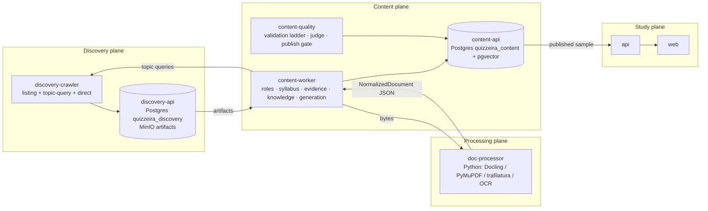
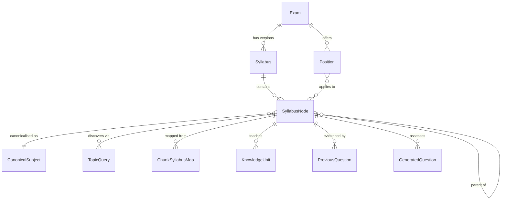
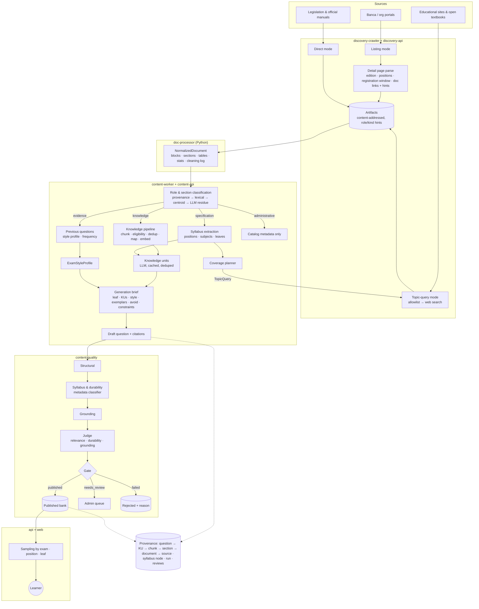

# Quizzeira Content Pipeline Redesign — Master Technical Specification

**Status:** Implementation on branch; §48.1 automated gate via `scripts/verify-pipeline-v2.sh` / `cleanup-and-verify-pipeline-v2.sh`. Operational DoD items (§48.4–5 pilot metrics / human sample) remain post-merge. **Date:** 2026-09-12. **Scope:** Discovery crawler, Content extraction/generation, Eval, and the data contracts between them.

> The system exists to teach and test the **knowledge required by the exam**, not the metadata describing the exam.

---

## Table of contents

1. Executive Summary
2. Current-System Diagnosis
3. Root-Cause Analysis
4. Examples of Current Failure
5. Product Definition: What a Good Question Is
6. Source Taxonomy
7. Tree-of-Thought Architecture Alternatives
8. Architecture Comparison
9. Recommended Architecture
10. End-to-End Pipeline
11. Crawling Strategy
12. Document Extraction Strategy
13. Deterministic Cleaning Pipeline
14. Document Classification
15. Edital / Syllabus Extraction
16. Normalized Curriculum Model
17. Study-Material Discovery
18. Previous-Exam Processing
19. Source Ranking
20. Content Quality Scoring
21. Syllabus Mapping
22. Chunk Eligibility
23. Knowledge Unit Extraction
24. Question Generation
25. Question Validation
26. Deduplication
27. LLM Usage Strategy
28. Cost Optimization
29. Data Models / Schemas
30. Provenance
31. Observability
32. Metrics
33. Error Handling
34. Retry Strategy
35. Storage Strategy
36. Node vs Python Analysis
37. Recommended Libraries
38. Service Boundaries
39. APIs / Interfaces
40. Migration Plan
41. Testing Strategy
42. Golden Dataset
43. Regression Tests for Image #1–#6
44. Rollout Plan
45. Risks and Mitigations
46. Implementation Phases
47. File-by-File Proposed Changes
48. Definition of Done
49. Final Architecture Diagram
50. Prioritized Implementation Checklist

---

## 1. Executive Summary

Quizzeira today runs a four-stage loop: `discovery-crawler` finds listing links on admin-registered portals and stores whatever it can download as an "artifact"; `content-worker` turns that artifact into ~3000-character chunks, embeds them, and asks an LLM to write multiple-choice questions "grounded" in the top-8 chunks; `content-quality` runs a deterministic shape check and an LLM judge, then publishes. Every stage works as designed. The design is the problem.

The six screenshots the user provided are the direct output of this loop: *"O Tribunal de Contas do Estado de Goiás está com inscrições abertas para qual cargo?"*, *"Qual associação oferece o 54º Exame para Certificação — CFP®?"*. These are not hallucinations and not prompt failures. They are exactly what the pipeline is built to produce, because:

- The crawler stores the **listing page** (a nav page of a concurso portal) as the exam's only artifact whenever it cannot find an edital PDF (`pipeline.ts:99`, `artifactUrl = open.editalUrl || open.listingUrl`).
- Content has **one document role**: every document is "material to generate questions from". There is no notion of "this document tells us *what* to study" versus "this document *is* the study material".
- Generation's retrieval query is literally `"<exam title> — geral — conteúdo programático e requisitos"` (`generation/index.ts:146`). It asks the vector index for the *administrative* parts of the corpus and gets them.
- The generation prompt tells the model to write questions "answerable from the provided material". Given a listing page, the only answerable questions are about the listing page. The model complied.
- The judge scores "factually correct, one defensible answer, clear, exam-appropriate". A question about which cargo TCE-GO is hiring for passes all four. Nothing in Eval asks "is this *syllabus knowledge*?"

This specification proposes replacing the single-role document model with a **role-typed pipeline** (Branch D below, a hybrid of B and C):

```
Exam ──▶ Specification documents (edital) ──▶ Syllabus (Subject ▸ Topic ▸ Subtopic)
                                                   │
        ┌──────────────────────────────────────────┴───────────────────────────┐
        ▼                                                                      ▼
  Evidence documents (provas, gabaritos)                          Knowledge documents (apostilas,
  → PreviousQuestion + per-topic style profile                     legislation, educational pages)
                                                                   → NormalizedDocument → Section → Chunk
                                                                     → syllabus-mapped, scored, deduped
                                                                     → KnowledgeUnit
        └──────────────────────────────┬───────────────────────────────────────┘
                                       ▼
                    Generation brief (topic + knowledge + style + constraints)
                                       ▼
                     Draft question ──▶ Validation ladder ──▶ Publish gate
```

Key decisions, each justified in its own section:

| Decision | Choice |
| --- | --- |
| Document role | First-class `DocumentRole` enum: `specification`, `evidence`, `knowledge`, `administrative`, `unknown`. Only `knowledge` and `evidence` can feed generation. |
| Syllabus | Extracted from the edital into a normalized `Subject → Topic → Subtopic` tree per `Exam × Position`. Deterministic parse first, LLM only to structure the ambiguous remainder. |
| Study content | The crawler gets a second job: **topic-driven discovery** of knowledge sources, ranked by domain authority and content density, with a curated allow-list seed. |
| Previous exams | Parsed into `PreviousQuestion` rows with banca/year/position/topic; used as style and frequency evidence, never republished verbatim except where the OAB module already does so under its own rules. |
| Extraction engine | A Python `doc-processor` service (Docling + PyMuPDF + trafilatura + OCR fallback) producing a versioned `NormalizedDocument` JSON. Node keeps orchestration, storage, APIs, generation, eval. |
| LLM boundary | Deterministic → heuristic → LLM, in that order, per stage. LLM calls are restricted to: syllabus structuring of unparsed residue, chunk topic classification of ambiguous chunks, knowledge-unit extraction, question generation, and the judge. Everything else is code. |
| Validation | A ladder: deterministic → syllabus mapping → metadata classifier → grounding check → LLM judge with an explicit "tests administrative metadata" rejection axis. |
| Provenance | Every `GeneratedQuestion` links to `KnowledgeUnit[] → Chunk[] → Section → NormalizedDocument → Document → Source`, plus `SyllabusNode` and optional `PreviousQuestion[]` style evidence. |

What survives from today: the service split (discovery / content / quality / study), MinIO document store, pgvector, worker-kit's LLM client and guardrails, the OAB module, the publish gate as the sole `published` writer, the HITL queue, and the structural validator. What goes: the listing-page-as-artifact fallback, the single `subject="geral"` generation path, the regex PDF reader as the primary extractor, and the "exam slug from anchor text" identity model.

---

## 2. Current-System Diagnosis

### 2.1 What actually runs, stage by stage

| Stage | Code | Input | Output | Observed behaviour |
| --- | --- | --- | --- | --- |
| Listing crawl | `apps/discovery-crawler/src/browser.ts`, `listing-parse.ts` | Source start URLs | `DiscoveredListing{title, href}` | Regex over `<a href>`; keeps anchors ≥8 chars that pass junk-title/junk-URL denylists and the source's `linkPatterns`. |
| Open detection | `packages/shared/src/crawler.ts:252-280` | Title + href | `status: "open" \| "unknown"` | `OPEN_RE` matches "inscrições abertas", "edital de abertura", "concurso público"; `looksOpenExamUrl` matches `/concurso/<x>-2026/`. |
| Exam identity | `normalizeOpenExam` | Title, href | `examSlug` | `/concurso/<slug>/` path, else first 80 chars of the anchor text slugified. |
| Artifact store | `pipeline.ts:95-113`, `storeArtifact` | `editalUrl \|\| listingUrl` | `Artifact{kind}` | `kind = /edital/i.test(url) ? "edital" : "other"`. HTML listing pages are stored with `kind: other`. |
| Import | `content-worker/extraction/index.ts:importDiscoveryArtifacts` | Artifacts | `Document` | 1:1 copy; `kind` carried over. |
| Text extraction | `pdf-text.ts` | bytes | string | Hand-rolled PDF content-stream reader (`Tj`/`TJ` operators); HTML: strip tags. No boilerplate removal, no reading-order recovery, no OCR. |
| Chunking | `chunk.ts` | string | `Chunk[]` | Paragraph packing to 3000 chars, 300 overlap, ≥40 chars kept. No classification. |
| Past-exam drafting | `mcq.ts` | prova text | draft items, `subject: "geral"` | Only when the answer key is in the same document. |
| Embedding | `embeddings/index.ts` | chunk text | 768-d vector | All chunks, regardless of content. |
| Generation | `generation/index.ts` | top-8 chunks by cosine to `"<title> — geral — conteúdo programático e requisitos"` | ≤6 drafts | `subject` hard-coded `"geral"`. |
| Eval | `content-quality/structural.ts`, `judge.ts`, `gate.ts` | draft | published / failed / needs_review | Shape checks + judge (factual, single answer, clear, exam-level). |
| Study | `content-api/routes/published.ts` | examSlug, subjects | sample | Subject filter falls back to whole exam when `geral`. |

### 2.2 The "exam" concept is a listing row

`Exam` in `quizzeira_discovery` is `(examSlug, listingUrl)` with `title`, `org`, `banca`, `emphasis` regex-guessed from the anchor text. There is no `Position` (cargo), no `edition`, no `syllabus`. A single listing page with six links yields six "exams" whose only artifact is the same listing page. This is visible in the screenshots: TCE-GO, SEF-SC, MANAUSPREV, FDSBC, and PLANEJAR CFP all appear as *distractors in the same question*, meaning they were chunks of the same document.

### 2.3 Document kind is a URL regex

`ArtifactKind` has five values (`edital`, `prova`, `gabarito`, `programa`, `other`) but outside the OAB module the value is chosen by `/edital/i.test(url)`. A prova PDF named `caderno_administracao.pdf` becomes `other`. A listing page becomes `other`. Content then treats `other` as generic study material.

### 2.4 The retrieval query is the failure encoded as a string

```ts
const query = [item.examTitle ?? item.examSlug, subject, "conteúdo programático e requisitos"]
```

With `subject = "geral"`, the retrieval asks for the parts of the corpus most similar to "*<exam name> — geral — programmatic content and requirements*". In an edital, that is the section listing cargos, vagas, requisitos, and the programa. In a listing page it is the whole page. The pipeline is optimised to find administrative text.

### 2.5 The generation prompt has no concept of topic

`buildGenerationPrompt` gives the model `Concurso`, `Disciplina: geral`, the material, and "write N questions answerable from this material, do not invent law numbers". There is no `Topic`, no `Subtopic`, no "the material must be *about* the syllabus item", and no negative instruction against administrative content. The model is correctly obeying an underspecified brief.

### 2.6 Eval cannot see the problem

`validateStructure` checks length, option count, duplicates, banned phrases, length outlier, context references. `judgeItem` asks four questions, none of which is "does this test syllabus knowledge?". `decide()` publishes on `score ≥ 0.8` with answer agreement. A metadata question is well-formed, factually correct, unambiguous, and "exam-level" in the sense the judge understands. It publishes.

### 2.7 The OAB module is the counter-example

`apps/content-worker/src/extraction/oab/` already embodies most of the right ideas: known document taxonomy from anchor labels, paired caderno+gabarito, layout-aware PDF reading, a per-subject blueprint, canonical numbering, discarding the "questionário de percepção" (which is exactly a metadata-rejection rule). It is exam-specific by design. The redesign generalises its *shape* (typed documents, structural parsing before any model, subject-keyed output) without generalising its FGV-specific parsers.

---

## 3. Root-Cause Analysis

The questions in the screenshots are the product of **five compounding failures**, ranked by causal weight. Fixing only the prompt (the usual reflex) addresses the least important one.

### RC-1 — Architectural: one document role

**Assumption baked into the code:** "Every document attached to an exam is study material."
**Evidence:** `Document.kind` is only used to route past-exam drafting (`PAST_EXAM_KINDS`); everything else, including `edital` and `other`, is chunked, embedded, and retrievable by generation. The concept doc says "Ingestion gets the bytes; Extraction turns bytes into text. Discovery has no idea what a question is" — true, but neither does Content know what an *edital* is for.
**Consequence:** The edital, whose purpose is to *specify* the syllabus, is consumed as if it *were* the syllabus content. The listing page, whose purpose is navigation, is consumed the same way.
**Classification:** modeling + architecture. This is the primary cause.

### RC-2 — Crawling: listing page stored as the exam's content

**Code:** `pipeline.ts:95-99`.
**Consequence:** For every exam where the board has not yet published a PDF, or where the anchor did not contain "edital", the only content in the corpus is portal chrome plus a list of other exams. This is where the specific distractors in the screenshots came from (MANAUSPREV, FDSBC, PLANEJAR are sibling links on the same portal).
**Classification:** crawling.

### RC-3 — Extraction: no cleaning, no classification, no sectioning

**Code:** `pdf-text.ts`, `chunk.ts`.
**Consequence:** Headers, footers, page numbers, nav menus, cookie banners, "Voltar para home" all become chunks. Chunks carry no section label, so a chunk of "Capítulo 4 — Das Inscrições" is indistinguishable from "Anexo II — Conteúdo Programático" or from a paragraph explaining concordância verbal.
**Classification:** extraction + classification.

### RC-4 — Generation: subject-less, topic-less, admin-seeking retrieval

**Code:** `generation/index.ts:73,146`, `prompt.ts`.
**Consequence:** Even with a clean edital, the retrieval pulls the programa/requisitos section and the model writes questions *about* that section.
**Classification:** modeling + prompt design.

### RC-5 — Validation: judge criteria do not include relevance

**Code:** `judge.ts:buildJudgePrompt`, `gate.ts`.
**Consequence:** Nothing downstream can catch RC-1..4. The gate is an *item quality* gate, not a *pedagogical relevance* gate.
**Classification:** validation design.

### Why the LLM "considers it valid question material"

Because it is told to. The system prompt is "Você é um elaborador de itens de concurso público brasileiro. Escreva apenas itens que possam ser respondidos a partir do material fornecido." The material is a listing page. Any competent item writer given only a listing page and told to write answerable items would write these. The model is not failing; the brief is.

### Verdict

This is a **multi-stage failure with an architectural root**. Crawling (RC-2) delivered garbage, extraction (RC-3) could not tell, generation (RC-4) sought the worst parts, validation (RC-5) had no criterion to reject — and all four were permitted by RC-1, the absence of document roles. The fix must introduce roles at the data model and enforce them at every stage boundary.

---

## 4. Examples of Current Failure

The six screenshots (memory: `screenshots/listing-trivia-quiz-*.png`) form one 6-question study session for a single exam slug. Each row maps the question to the failure that produced it and to the regression fixture ID used in §43.

| # | Question (pt-BR) | What it actually tests | Correct source of the text | Failure | Fixture |
| --- | --- | --- | --- | --- | --- |
| 1 | O Tribunal de Contas do Estado de Goiás está com inscrições abertas para qual cargo? | Which cargo a portal listing advertises | Listing page anchor "TCE-GO — Técnico de Controle Externo — inscrições abertas" | RC-2, RC-1 | `REG-001` |
| 2 | Qual associação oferece o 54º Exame para Certificação — CFP®? | Organising body of a non-concurso certification | Sibling listing anchor (PLANEJAR) | RC-2 (open-detection false positive), RC-1 | `REG-002` |
| 3 | Qual cargo está sendo oferecido pela Secretaria de Estado da Fazenda de Santa Catarina? | Vacancy metadata | Sibling listing anchor | RC-2, RC-1 | `REG-003` |
| 4 | O cargo de Técnico de Controle Externo é oferecido por qual instituição? | Reverse of #1 | Same anchor as #1 | RC-4 (model paraphrases the same chunk) | `REG-004` |
| 5 | Qual o nome da associação que realiza o 54º Exame para Certificação — CFP®? | Duplicate of #2 | Same | RC-4, plus dedup gap (fingerprint is on exact prompt text) | `REG-005` |
| 6 | O que a PLANEJAR — Associação Brasileira de Planejamento Financeiro está promovendo? | Event metadata | Same anchor | RC-2, RC-1 | `REG-006` |

Additional failure classes the fixtures must cover even though not all appear in the screenshots, because the same pipeline will produce them from a real edital:

| Class | Example prompt | Fixture |
| --- | --- | --- |
| Vacancy count | "Quantas vagas são oferecidas para o cargo de Analista?" | `REG-101` |
| Salary | "Qual a remuneração inicial do cargo de Técnico?" | `REG-102` |
| Registration period | "Até que data podem ser realizadas as inscrições?" | `REG-103` |
| Fee | "Qual o valor da taxa de inscrição?" | `REG-104` |
| Banca identity | "Qual instituição é responsável pela organização do concurso?" | `REG-105` |
| Edital number | "Qual o número do edital de abertura?" | `REG-106` |
| Exam venue / date | "Em que cidade será aplicada a prova objetiva?" | `REG-107` |
| Syllabus meta | "Quais assuntos de Língua Portuguesa constam no conteúdo programático?" | `REG-108` |
| Procedural | "Qual documento deve ser apresentado no dia da prova?" | `REG-109` |
| Requirements | "Qual a escolaridade exigida para o cargo?" | `REG-110` |
| Structure | "Quantas questões terá a prova objetiva?" | `REG-111` |

And the positive counterparts (what the same edital *should* lead to):

| Syllabus node | Good question | Fixture |
| --- | --- | --- |
| Português ▸ Sintaxe ▸ Concordância verbal | "Assinale a alternativa em que a concordância verbal está de acordo com a norma-padrão: …" | `POS-001` |
| Português ▸ Interpretação de texto | Short passage + "Infere-se do texto que…" | `POS-002` |
| Matemática ▸ Porcentagem | "Um produto de R$ 250,00 sofreu dois aumentos sucessivos de 10%. O preço final é…" | `POS-003` |
| Direito Administrativo ▸ Licitações ▸ Modalidades | "Nos termos da Lei 14.133/2021, a modalidade de licitação obrigatória para…" | `POS-004` |
| Raciocínio lógico ▸ Proposições | "Considere a proposição 'Se chove, então a rua fica molhada'. Sua contrapositiva é…" | `POS-005` |

---

## 5. Product Definition: What a Good Question Is

A question is **good** when a candidate who answers it correctly has demonstrated knowledge that the real exam is likely to test. Everything else is a proxy. The definition below is the acceptance contract for the whole pipeline and is restated as executable checks in §25.

### 5.1 Positive criteria (all required)

| ID | Criterion | Operationalised as |
| --- | --- | --- |
| G1 | **Maps to a syllabus node.** The question is about a `Subtopic` (or `Topic` when the edital stops at that depth) of the exam's normalized curriculum. | `GeneratedQuestion.syllabusNodeId` non-null and mapping confidence ≥ 0.6. |
| G2 | **Tests durable knowledge.** The correct answer would still be correct in five years, independent of this edition of the exam. | Fails if the answer depends on edition-bound facts (dates, counts, fees, names of organisers). |
| G3 | **Grounded in knowledge evidence.** The correct answer is supported by ≥1 `KnowledgeUnit` from a `knowledge` or `evidence` role document. | `evidence[]` non-empty, grounding check passes. |
| G4 | **Self-contained.** No reference to "the text above" unless the passage is included in the prompt (interpretation questions embed the passage). | Structural check + passage embedding rule. |
| G5 | **Exactly one defensible answer.** | Judge independent answer agrees; distractor plausibility check. |
| G6 | **Banca-appropriate form.** Option count, register, and difficulty match the `ExamStyleProfile` derived from previous exams (or the default profile when none exists). | Style profile check. |
| G7 | **Explained.** Explanation cites the rule/fact, not the edital. | Explanation non-empty; must not cite `specification` docs. |

### 5.2 Negative criteria (any one rejects)

| ID | Criterion |
| --- | --- |
| B1 | Tests **exam metadata**: organiser, banca, edital number, publication date, positions offered, vacancies, salary, fee, registration window, venues, schedule, number of questions, weights, cut-off, eligibility requirements, required documents. |
| B2 | Tests **syllabus meta-knowledge**: "which topics are in the programa", "which subjects are on the exam". |
| B3 | Tests **portal/navigation** content. |
| B4 | Tests **procedural instructions** to candidates. |
| B5 | Is **trivia** relative to the syllabus: a fact incidental to the topic (a scholar's birth year in a Direito Constitucional question). |
| B6 | Depends on **temporary** information (current officeholders, current values of indexes) unless the syllabus node is explicitly about them. |
| B7 | Is a **verbatim copy** of a `PreviousQuestion` outside the OAB module's explicit transcription path. |
| B8 | Is a **near-duplicate** of a published or drafted item for the same syllabus node. |

### 5.3 Worked contrast

Edital text (specification role):
> "LÍNGUA PORTUGUESA: 1. Compreensão e interpretação de textos. 2. Ortografia oficial. 3. Concordância verbal e nominal. 4. Regência verbal e nominal. 5. Pontuação."

Wrong output (today): *"Qual dos itens abaixo consta no conteúdo programático de Língua Portuguesa?"* → B2.

Right path: `Português ▸ Sintaxe ▸ Concordância verbal` becomes a `SyllabusNode`. Discovery finds a grammar reference page on concordância verbal (knowledge role). A `KnowledgeUnit` is extracted: *"Com sujeito composto anteposto ao verbo, o verbo vai para o plural."* Generation writes: *"Assinale a frase em que a concordância verbal está correta: (A) Chegou os convidados… (B) Chegaram os convidados… "* → G1..G7.

### 5.4 Why the edital is still ingested

The edital is the **most authoritative source of what to study** and often the only source of position-specific weighting. It is ingested, parsed, and used — as a specification. It is never a retrieval target for generation, and its chunks are never embedded into the knowledge index. That single rule would have prevented ~80% of the failure classes in §4 on its own.

---

## 6. Source Taxonomy

### 6.1 Two orthogonal axes

The current schema conflates "where it came from" with "what it is for". The redesign separates:

- **`SourceKind`** — the nature of the *site/publisher* (crawl policy lives here).
- **`DocumentRole`** — the semantic purpose of an *individual document* (eligibility lives here).

A single source can yield documents of several roles (a banca portal publishes editais, provas, and registration pages). A single role can come from many source kinds.

### 6.2 `SourceKind` (per registered Source)

| Kind | Examples | Crawl strategy | Default trust | Typical roles produced |
| --- | --- | --- | --- | --- |
| `banca_portal` | cesgranrio.org.br, cebraspe.org.br, fgv.br, vunesp.com.br, fcc.org.br | listing → concurso page → document list | high | specification, evidence, administrative |
| `org_portal` | transpetro.com.br/carreiras, prefeitura sites, tribunal sites | listing → announcement | high | specification, administrative |
| `aggregator` | pciconcursos.com.br, concursosnobrasil, qconcursos listings | listing → outbound links | medium | administrative (pointers), sometimes evidence |
| `official_gazette` | in.gov.br (DOU), diários oficiais estaduais | search by edital number | high | specification |
| `legislation` | planalto.gov.br, senado.leg.br/legislacao, lexml | direct URL per norm | high | knowledge |
| `educational_site` | curated grammar/math/law reference sites | topic query → page | medium (per-domain override) | knowledge |
| `open_textbook` | public-domain or CC-licensed apostilas, gov.br educational PDFs | direct URL | medium-high | knowledge |
| `standards_body` | ABNT summaries on gov sites, ANS/ANVISA manuals | direct URL | high | knowledge |
| `question_bank_public` | public past-question repositories with clear licensing | topic query → question pages | medium | evidence |
| `exam_specific` | oab.fgv.br (existing `oab-fgv` strategy) | custom | high | specification, evidence |
| `fixture` | test fixtures | file | n/a | any |

Each `Source` row gains: `kind`, `allowedRoles[]` (roles this source may produce; a listing aggregator cannot produce `knowledge`), `discoveryMode` (`listing` \| `topic_query` \| `direct` \| `custom`), `licenseNote`, `robotsPolicy` (respect, cached), `authorityScore` (0–1, admin-set with defaults per kind).

### 6.3 `DocumentRole` (per Document)

| Role | Definition | Generation eligible | Embedded in knowledge index | Consumed by |
| --- | --- | --- | --- | --- |
| `specification` | Defines what the candidate must know: edital, anexo de conteúdo programático, retificação, official syllabus, programa. | **No** | **No** | Syllabus extraction |
| `evidence` | Shows what has been tested: prova, caderno, gabarito (preliminar/definitivo), padrão de resposta, official question commentary. | Indirectly (style + frequency + optional transcription) | No (separate `PreviousQuestion` index) | Previous-exam processing |
| `knowledge` | Teaches the content: apostila, textbook chapter, grammar reference, law text, manual, technical documentation, educational article. | **Yes** | **Yes** | Knowledge pipeline |
| `administrative` | Registration pages, candidate portals, listing pages, FAQs about the process, result announcements, schedules, convocations. | **No** | No | Exam catalog metadata only (dates, links) |
| `mixed` | Document that contains sections of more than one role (an edital with an anexo de conteúdo programático is `specification` overall but its "Das Inscrições" chapter is `administrative`). | Per-section | Per-section | Section classifier splits it |
| `unknown` | Not yet classified, or classifier confidence below threshold. | No | No | HITL / reclassification |

Rule: **role is assigned before extraction results are persisted as chunks**, and a chunk inherits `sectionRole` which can be narrower than the document role (a `knowledge` apostila may contain an `administrative` "sobre o autor" section).

### 6.4 `DocumentSubtype` (finer, optional)

Within each role, a subtype drives the parser choice:

- `specification`: `edital_abertura`, `edital_retificacao`, `conteudo_programatico_anexo`, `programa_oficial`
- `evidence`: `prova_objetiva`, `prova_discursiva`, `gabarito_preliminar`, `gabarito_definitivo`, `padrao_resposta`, `questoes_comentadas`
- `knowledge`: `apostila`, `livro_capitulo`, `artigo_educacional`, `lei`, `decreto`, `sumula`, `manual`, `documentacao_tecnica`, `resumo`
- `administrative`: `listagem`, `inscricao`, `cronograma`, `resultado`, `convocacao`, `faq`, `noticia`

### 6.5 Eligibility matrix

```
                        specification  evidence  knowledge  administrative  unknown
syllabus extraction          ✔            –         –            –            –
previous-question parse      –            ✔         –            –            –
knowledge index (embed)      –            –         ✔            –            –
generation retrieval         –            –         ✔            –            –
style profile                –            ✔         –            –            –
catalog metadata             ✔            –         –            ✔            –
```

---

## 7. Tree-of-Thought Architecture Alternatives

### Branch A — Improve the existing crawler

**Shape:** Keep `Artifact → Document → Chunk → Generation`. Add: a document classifier on import, a section classifier on chunks, a `chunkRole` filter in `searchChunks`, a metadata-probability score, an exam-topic extractor that populates `GenerationRun.subject`, and a rewritten prompt with negative instructions.

**How far it goes:** It stops the listing page from reaching generation (if the classifier is good) and stops edital "Das Inscrições" chunks from being retrieved. It does *not* give the pipeline any study material to generate from: with the listing-page fallback removed and the edital demoted, most exams would have **zero eligible chunks**. The system would go from wrong questions to no questions. It also keeps the exam identity model (`examSlug` from anchor text), so the `Position` dimension stays absent and the syllabus cannot be attached anywhere durable.

**Verdict:** Necessary components (classification, filtering, better prompts) but insufficient architecture. Branch A's parts are absorbed into the recommendation; Branch A alone is rejected.

### Branch B — Separate "Exam Specification" from "Study Content"

**Shape:** `edital → syllabus extraction → normalized topics → study-material discovery → content ingestion → question generation`. The edital is a *specification*; the crawler gets a second, topic-driven discovery mode; generation is keyed by `(Exam, Position, SyllabusNode)`.

**Strengths:** Directly attacks RC-1 and RC-4. Gives generation a real unit of work (a syllabus node) instead of an exam slug. Makes "what should I study for this cargo" a product feature. Aligns with how the OAB module already works (subject blueprint → per-subject drafts).

**Weaknesses on its own:** Says nothing about *how* study content is cleaned, sectioned, scored, or deduplicated; a naive implementation would ingest SEO pages and produce plausible-but-shallow questions. Says nothing about previous exams as evidence. Leaves extraction quality (RC-3) unaddressed.

**Verdict:** The correct backbone. Needs Branch C's processing discipline.

### Branch C — Content Intelligence Pipeline

**Shape:** The fourteen-stage pipeline in the brief: acquisition → type detection → extraction → deterministic cleanup → structural parsing → classification → syllabus mapping → quality scoring → dedup → knowledge extraction → generation → validation → scoring.

**Strengths:** Attacks RC-3 and RC-5 thoroughly. Every stage is a pure function on a typed intermediate representation, which is what makes the pipeline testable and observable. Forces the "LLM last" ordering.

**Weaknesses on its own:** It is a *processing* architecture, not a *sourcing* architecture. Without Branch B it would process the same listing pages more carefully and still have nothing to teach from. Fourteen stages is also more service boundaries than the team needs; several stages are one function each and belong in the same worker.

**Verdict:** The correct *internal structure* for the knowledge and evidence paths. Collapsed into fewer deployable units.

### Branch D — Role-typed hybrid (recommended)

**Shape:** Branch B's three-role backbone (specification / evidence / knowledge) with Branch C's staged processing applied *per role*, and Branch A's classifiers as the routing mechanism. Plus two additions discovered while reading the repo:

1. **Position-scoped syllabus.** Brazilian editais almost always have a *conhecimentos básicos* block shared by all cargos and *conhecimentos específicos* per cargo. The data model must carry `Exam → Position → SyllabusNode` or the specific block is unattributable. The current `emphasis: string[]` field is a vestige of this need.
2. **Style profile from evidence.** Previous exams feed an `ExamStyleProfile` per `(banca, subject)` — option count, average stem length, passage usage rate, "assinale a INCORRETA" frequency, difficulty proxies — which becomes a generation constraint. This is cheap (pure aggregation over `PreviousQuestion`) and is the main lever for "sounds like the real exam".

**Deployable units:** four (down from C's implied fourteen): `discovery-crawler` (extended), `doc-processor` (new, Python), `content-worker` (rewritten stages), `content-quality` (extended). APIs and DBs stay where they are.

### Branch E — Considered and rejected: "LLM-agentic crawler"

Let an LLM agent browse for each topic, read pages, and write questions in one loop. Rejected: no provenance, no dedup, token cost proportional to pages read rather than knowledge extracted, untestable, and it violates "LLM last". Noted so nobody proposes it later.

---

## 8. Architecture Comparison

Scores 1 (worst) to 5 (best). "Complexity" is inverted (5 = simplest).

| Criterion | A: Improve | B: Spec vs Content | C: Content Intelligence | D: Role-typed hybrid | E: Agentic |
| --- | --- | --- | --- | --- | --- |
| Reliability (no metadata questions) | 3 | 4 | 4 | **5** | 2 |
| Question quality (exam-relevant) | 2 | 4 | 3 | **5** | 3 |
| Implementation complexity | **5** | 3 | 2 | 3 | 4 |
| Crawling robustness | 2 | 4 | 3 | **4** | 2 |
| Token consumption | 3 | 4 | 4 | **5** | 1 |
| LLM dependency (lower is better → higher score) | 3 | 4 | 4 | **5** | 1 |
| Deterministic processing share | 2 | 3 | **5** | **5** | 1 |
| Maintainability | 3 | 4 | 3 | **4** | 2 |
| Observability / provenance | 2 | 3 | **5** | **5** | 1 |
| Cost (infra + tokens) | 4 | 4 | 3 | 4 | 1 |
| Scalability (exams × topics) | 2 | 4 | 4 | **5** | 2 |
| **Total** | 31 | 41 | 40 | **50** | 20 |

Decisive factors:

- Only B and D give generation a **unit of work that is a syllabus node**. Without that, no amount of filtering makes questions relevant.
- Only C and D make every stage a **typed pure function** with an inspectable intermediate. That is what makes the regression tests in §43 possible.
- D's Python `doc-processor` adds one runtime but removes the hand-rolled PDF reader, adds OCR/DOCX/PPTX for free, and isolates heavy native dependencies from the Node services.

---

## 9. Recommended Architecture

### 9.1 One-paragraph statement

Documents are typed by role at ingestion. Specification documents are parsed into a per-position syllabus tree. Evidence documents are parsed into previous questions and aggregated into a style profile. Knowledge documents are discovered per syllabus node, normalized by a Python document processor into a structured representation, cleaned and sectioned deterministically, classified, mapped to syllabus nodes, scored, deduplicated, and distilled into knowledge units. Generation receives a curated brief per syllabus node; validation rejects anything that is not durable syllabus knowledge; the publish gate remains the only writer of `published`.

### 9.2 Service map



### 9.3 Stage ownership

| Stage | Owner | Deterministic / heuristic / LLM |
| --- | --- | --- |
| Source registry, robots, politeness, fetch, store bytes | discovery-crawler + discovery-api | deterministic |
| Open-exam detection | discovery-crawler | heuristic (regex + date parse) → LLM only for ambiguous listing pages, batched |
| Topic-query discovery, candidate ranking | discovery-crawler | deterministic ranking over heuristic signals |
| Format detection, text/layout extraction, OCR, tables | doc-processor | deterministic |
| Boilerplate/nav/header/footer removal, normalization | doc-processor | deterministic |
| Structural parsing (headings, lists, articles) | doc-processor | deterministic |
| Document role classification | content-worker | deterministic signals → heuristic score → LLM for `unknown` residue |
| Section role classification | content-worker | heuristic (per-section signals) → LLM for ambiguous |
| Syllabus extraction | content-worker | deterministic outline parse → LLM structuring of unparsed residue |
| Previous-question parse | content-worker (existing `mcq.ts` + OAB, extended) | deterministic |
| Style profile | content-worker | deterministic aggregation |
| Syllabus mapping of chunks | content-worker | deterministic lexical + embedding similarity → LLM for ambiguous band |
| Content quality scoring | content-worker | deterministic + heuristic |
| Dedup (exact, near, semantic) | content-worker + content-api | deterministic |
| Knowledge unit extraction | content-worker | LLM (batched, cached by chunk hash) |
| Question generation | content-worker | LLM |
| Structural validation, metadata classifier, grounding check | content-quality | deterministic + heuristic |
| Judge | content-quality | LLM |
| Publish decision | content-quality | deterministic |

### 9.4 Invariants (enforced in code, tested in §41)

1. No chunk with `sectionRole ≠ knowledge` is ever embedded into the knowledge index.
2. No generation run exists without a `syllabusNodeId`.
3. No `GeneratedQuestion` reaches Eval without ≥1 `KnowledgeUnit` reference.
4. No document with role `administrative` or `specification` is ever cited as grounding evidence.
5. `published` is written only by `content-quality`'s gate.
6. Every rejection carries a machine-readable reason.

---

## 10. End-to-End Pipeline

### 10.1 Sequence for one exam (happy path)

```mermaid
sequenceDiagram
  participant Admin
  participant DC as discovery-crawler
  participant DA as discovery-api
  participant CW as content-worker
  participant DP as doc-processor
  participant CA as content-api
  participant CQ as content-quality

  Admin->>DA: register Source(kind=banca_portal)
  DC->>DA: listing crawl → Exam(edition) + candidate documents (url, label, hints)
  DC->>DA: fetch bytes → Artifact(kind hint, contentType, checksum)
  CW->>DA: pull unprocessed artifacts
  CW->>DP: POST /process (bytes, hints)
  DP-->>CW: NormalizedDocument v1 (sections, blocks, tables, stats)
  CW->>CW: role classification (deterministic → heuristic → LLM residue)
  alt role = specification
    CW->>CW: syllabus extraction → SyllabusNode tree per Position
    CW->>CA: upsert Syllabus
    CW->>DA: enqueue TopicQuery(exam, node) for each leaf lacking knowledge coverage
  else role = evidence
    CW->>CW: previous-question parse (mcq.ts / OAB) → PreviousQuestion
    CW->>CA: upsert PreviousQuestion + refresh ExamStyleProfile
  else role = knowledge
    CW->>CW: clean → section → chunk → classify → map → score → dedup
    CW->>CA: persist Chunk(sectionRole, syllabusNodeIds, scores)
    CW->>CA: embed eligible chunks only
    CW->>CW: KnowledgeUnit extraction (LLM, batched)
    CW->>CA: persist KnowledgeUnit
  else role = administrative
    CW->>CA: persist Document(role) only; extract catalog facts (dates, links)
  end
  DC->>DA: topic-query discovery → candidate knowledge URLs → Artifact(roleHint=knowledge)
  CW->>CA: generation queue = SyllabusNodes with KnowledgeUnits ≥ N and deficit > 0
  CW->>CW: build GenerationBrief(node, units, style, constraints)
  CW->>CA: draft GeneratedQuestion(provenance)
  CQ->>CA: pending drafts
  CQ->>CQ: validation ladder → judge → gate
  CQ->>CA: verdict (published / failed / needs_review)
```

### 10.2 Queues and their keys

| Queue | Key | Producer | Consumer | Idempotency |
| --- | --- | --- | --- | --- |
| `artifact.unprocessed` | `Artifact.id` | discovery-crawler | content-worker import | `Document.discoveryArtifactId` unique |
| `document.normalize` | `Document.id` | import | content-worker → doc-processor | `NormalizedDocument.contentHash` |
| `document.classify` | `Document.id` | normalize | role classifier | `Document.roleVersion` |
| `syllabus.extract` | `Document.id` (role=specification) | classifier | syllabus extractor | `Syllabus.sourceDocumentHash` |
| `evidence.parse` | `Document.id` (role=evidence) | classifier | previous-question parser | `PreviousQuestion.fingerprint` |
| `knowledge.process` | `Document.id` (role=knowledge) | classifier | knowledge pipeline | `Chunk.contentHash` |
| `chunk.embed` | `Chunk.id` (eligible) | knowledge pipeline | embedder | `Chunk.embedding IS NULL` |
| `chunk.distill` | `Chunk.id` (eligible, mapped) | knowledge pipeline | KU extractor | `KnowledgeUnit.sourceChunkHash` |
| `topic.discover` | `(examId, syllabusNodeId)` | syllabus extractor | discovery-crawler topic mode | `TopicQuery.status` |
| `generation` | `(examId, positionId, syllabusNodeId)` | coverage planner | generator | `GenerationRun` |
| `eval` | `GeneratedQuestion.id` | generator | content-quality | `QualityReview` |

All queues remain **Postgres-backed status columns polled by workers**, matching the current `runLoop` design. No message broker is introduced.

### 10.3 Data volume expectations (per exam, order of magnitude)

| Stage | Typical count |
| --- | --- |
| Specification documents | 1–4 (edital + retificações + anexo) |
| Syllabus nodes | 60–300 leaves across 5–12 subjects |
| Evidence documents | 0–10 (previous editions from same banca/org) |
| Previous questions | 0–800 |
| Knowledge documents | 2–5 per leaf → 150–1500 |
| Raw chunks | 5k–50k |
| Eligible chunks after cleaning + role + mapping + dedup | 1k–8k (≈15–20%) |
| Knowledge units | 2k–15k |
| Generated questions (target) | 10–30 per leaf → 600–9000 |

---

## 11. Crawling Strategy

### 11.1 Three discovery modes

| Mode | Trigger | Input | Output | Replaces |
| --- | --- | --- | --- | --- |
| **Listing** | Source schedule | Source start URLs | Exam candidates + document candidates | current `listing-links` (kept, hardened) |
| **Topic query** | `TopicQuery` rows created by syllabus extraction | `(exam, syllabusNode, queryStrings[])` | Knowledge document candidates | new |
| **Direct** | Admin or seed list | URL + role hint | One document | new (covers legislation, curated apostilas) |
| **Custom** | Source strategy | as today | as today | `oab-fgv` unchanged |

### 11.2 Listing mode — hardened

Changes to the existing path, in order of impact:

1. **Never store the listing page as an exam artifact.** Store it as `Artifact(kind=listing, roleHint=administrative)` attached to the *Source*, not to an Exam, for debugging only. Its bytes are never handed to content-worker's knowledge path.
2. **Exam identity = (org, edition key)**, not anchor text. Parse the *concurso detail page* (one hop from the listing) for the edital number, org name, and year. Slug = `slugify(org) + "-" + editionKey`. Anchor text becomes `Exam.title` only.
3. **Document candidates come from the detail page**, not the listing. Every `<a>` on the detail page whose href or label matches the document taxonomy in §14.2 becomes an `Artifact` with a `kindHint`. This is how the OAB module already works and is the single most useful generalisation.
4. **Open detection** stays regex-first but adds a **date extractor**: find "inscrições … de DD/MM/AAAA a DD/MM/AAAA" patterns on the detail page; `status = open` iff today ≤ end date. Regex "inscrições abertas" alone becomes `likelyOpen`, not `open`. Unparseable pages fall to a batched LLM classification once per detail page (not per anchor), cached by page hash.
5. **Non-concurso filter.** Detail pages whose parsed title matches certification / vestibular / processo seletivo de faculdade patterns (`CFP`, `certificação`, `vestibular`, `mestrado`, `residência` without `concurso`) are stored with `Exam.kind = other` and excluded from the study catalog. Screenshot #2 and #6 are this bug.
6. **Sibling isolation.** Documents are attached only to the exam whose detail page linked them. A listing row can never contribute documents to another row.

### 11.3 Topic-query mode

Input: a `TopicQuery` row `(examId, positionId, syllabusNodeId, queries[], status)`.

```
for each query in queries (≤3 per node, generated deterministically, see §17.2):
  candidates = search(query)            # provider abstraction, see §17.4
  for each candidate URL (≤10):
    if domain in denylist → skip
    if domain not in allowlist and domainAuthority(domain) < minAuthority → skip
    if url already known (normalized) → link existing Document to node, skip fetch
    fetch (politeness per domain, robots respected, size cap)
    store Artifact(kindHint=knowledge, roleHint=knowledge, topicHint=syllabusNodeId, sourceRankSignals)
mark TopicQuery done; record candidatesFound / candidatesStored
```

Budget controls: `TOPIC_DISCOVERY_MAX_QUERIES_PER_PASS`, `…_MAX_FETCH_PER_DOMAIN_PER_DAY`, `…_MAX_CANDIDATES_PER_NODE`. Coverage planner (§17.5) decides which nodes get queries first.

### 11.4 Direct mode

`Source(kind=legislation|open_textbook|standards_body, discoveryMode=direct)` with `startUrls` being the documents themselves. Fetched once, refreshed by `ETag`/`Last-Modified`/content hash. Used for: Constituição, Códigos, Leis 8.112/8.666/14.133/9.784, CLT, Súmulas, and curated apostilas. This is the highest-precision knowledge path and should be seeded on day one (admin action, not a code seed — the "ships empty" policy still holds, but the spec provides a recommended seed list in §17.6).

### 11.5 Politeness and legality

- `robots.txt` fetched and cached per domain (24h); disallowed paths skipped; crawler UA unchanged.
- Per-domain concurrency 1, per-domain delay ≥ `Source.politenessMs` (default 1500ms for topic mode).
- `licenseNote` on Source; content from domains with restrictive terms is `knowledge` but flagged `redistributable=false`, which means KUs may ground questions but chunk text is never shown to users.
- Size caps: 16 MB per artifact (existing), 200 pages per PDF for OCR.

### 11.6 Fetch layer

Playwright stays for listing/detail pages of JS-heavy portals. Topic-query and direct mode use plain HTTP (`undici`) first and fall back to Playwright only when the HTML body is < 2 KB of text or is a known SPA shell. This halves crawler CPU for the knowledge path.

---

## 12. Document Extraction Strategy

Extraction is performed by the Python `doc-processor` service and returns `NormalizedDocument` (§29.3). Node never parses PDFs again except in the OAB module, which keeps its geometry-based readers because they are tested and FGV-specific.

### 12.1 Per-format strategy

| Format | Detection | Primary | Fallback 1 | Fallback 2 | Notes |
| --- | --- | --- | --- | --- | --- |
| PDF (text layer) | `%PDF` magic + PyMuPDF `page.get_text()` ≥ 10 chars on ≥ 50% of sampled pages | PyMuPDF `get_text("dict")` with column detection (§12.3) | Docling `StandardPdfPipeline` (`do_ocr=False`, `do_table_structure=True`) when heading/list structure is needed (editais, apostilas) | — | PyMuPDF is ~10× faster; Docling is used when the role hint is `specification` or the deterministic sectioner finds < 3 headings. |
| PDF (scanned) | text-layer test fails | Docling with `do_ocr=True`, `TesseractOcrOptions(lang=["por"])` | `ocrmypdf --language por` then PyMuPDF | mark `failed(ocr_low_confidence)` if mean OCR confidence < 0.6 | Page cap 200; OCR only for `specification` and `evidence` roles by default (knowledge OCR is opt-in per source). |
| PDF (mixed) | per-page test | per-page routing | — | — | Common for provas with scanned figures. |
| HTML | content-type / `<html` | trafilatura `bare_extraction(favor_precision=True, include_tables=True, with_metadata=True)` | readability-lxml | raw `<body>` text with tag stripping | trafilatura returns main text + metadata (title, author, date, sitename) which feed source ranking. |
| DOCX | zip + `word/document.xml` | Docling `WordFormatOption(SimplePipeline)` | `python-docx` paragraph/heading walk | — | Headings preserved as `Section` boundaries. |
| DOC (legacy) | OLE magic | `libreoffice --headless --convert-to docx` then DOCX path | `antiword` | — | LibreOffice in the doc-processor image. |
| PPTX | zip + `ppt/` | Docling PPTX backend | `python-pptx` | — | Each slide → one `Section`; speaker notes included. |
| PPT | OLE | LibreOffice → PPTX | — | — | |
| TXT / MD | content-type | direct | — | — | Markdown headings honoured. |
| EPUB | zip + `mimetype` | `ebooklib` → per-chapter HTML → trafilatura | — | — | Only from sources with `licenseNote` allowing it; otherwise skipped. |
| Images (PNG/JPG) | magic | Docling image pipeline with OCR | — | — | Rare; only when linked as "gabarito" images. |
| Unknown | — | `failed(unsupported_format)` | — | — | |

### 12.2 Output contract

Every path produces the same `NormalizedDocument`:

- `blocks[]` in reading order, each `{type: heading|paragraph|list_item|table|caption|footnote|page_artifact, text, level?, page?, bbox?, fontStats?}`
- `sections[]` built from headings (§13.4)
- `tables[]` as cell grids with a markdown rendering
- `stats` (pages, chars, textLayerRatio, ocrConfidence, languageGuess, blocksByType)
- `extractor` (`{engine, version, options}`) for provenance

### 12.3 Two-column and reading-order recovery (PDF)

Brazilian provas are commonly two-column. Algorithm (deterministic, in doc-processor):

1. `blocks = page.get_text("dict")["blocks"]` with bboxes.
2. Compute x-centre histogram; if bimodal with valley near page centre and ≥ 70% of blocks in the two modes → two columns.
3. Assign blocks to columns by x-centre; sort each column by y; concatenate left then right.
4. Else single column: sort by `(y, x)` with a tolerance band of 3pt.
5. Lines are joined into paragraphs when vertical gap < 1.4 × median line height and no hyphen-break rule applies (§13.2).

The OAB module's `pdf-layout.ts` does a version of this in Node; it stays for OAB and is not generalised.

### 12.4 Tables

Tables are kept as structured cells because editais put *conteúdo programático*, *quadro de vagas*, and *cronograma* in tables. The syllabus extractor reads `tables[]` directly; the administrative classifier uses table headers ("Vagas", "Remuneração", "Data") as strong signals.

---

## 13. Deterministic Cleaning Pipeline

All steps are pure functions over `NormalizedDocument`, run in doc-processor (text-level) and content-worker (structure-level). Each step records what it removed in `cleaningLog[]` so regressions are diagnosable.

### 13.1 Text-level (doc-processor)

| Step | Rule | Classification |
| --- | --- | --- |
| Encoding normalisation | NFC; mojibake repair via `ftfy`; replace NBSP/zero-width; unify quotes and dashes | deterministic |
| Whitespace | collapse runs; preserve paragraph breaks; strip trailing spaces | deterministic |
| Page-artifact removal | a line repeated on ≥ 60% of pages at top or bottom 10% of page height → `page_artifact` (headers/footers); lines matching `^\s*(Página\s+)?\d+(\s*/\s*\d+)?\s*$` → page numbers | deterministic |
| Hyphenation repair | `(\w+)-\n(\w+)` joined when the joined form appears elsewhere in the document or the second part starts lowercase | deterministic |
| Ligature/glyph fixes | `fi fl` → `fi fl`; private-use glyph runs → flagged `glyphNoise` | deterministic |
| HTML boilerplate | trafilatura main-content extraction; additionally strip `nav, header, footer, aside, form, [role=navigation], .cookie*, .breadcrumb*, .share*, .related*` | deterministic |
| Link density filter | any block with link chars / total chars > 0.5 and < 200 chars → `boilerplate` | deterministic |
| Repeated-block removal | blocks whose normalised text appears in ≥ 3 documents from the same domain (domain-level shingle cache) → `boilerplate` | deterministic |
| Garbage detection | ratio of alphabetic chars < 0.6, or avg word length > 14, or > 30% tokens not in a pt-BR/en wordlist → `garbage` | deterministic |
| Language detection | `lingua` (deterministic model) per section; non-`pt`/`en` sections flagged; document language = majority | deterministic |
| Minimum content | document with < 400 chars of non-boilerplate text → `failed(too_short)` unless role hint is `evidence` (gabaritos are short) | deterministic |

### 13.2 Structure-level (content-worker, over blocks)

| Step | Rule |
| --- | --- |
| Heading detection | block `type=heading` from extractor; else font-size ≥ 1.15 × body median and ≤ 120 chars; else regex outline markers `^(\d+(\.\d+)*|[IVXLC]+|[A-Z])[.)\-–]\s+\S` |
| Outline levels | numeric depth (`1`, `1.1`, `1.1.1`); roman → level 1; letters → next level; font size tiers when no markers |
| Section building | a section = heading + following blocks until next heading of same or higher level; nested sections retain parent path `["Anexo II", "Conhecimentos Específicos", "Analista"]` |
| List normalisation | `a)`, `(a)`, `•`, `–`, `I –` markers stripped into `list_item.level` |
| Legal-text segmentation | `Art. N`, `§ N`, `Inciso`, `Alínea` recognised as structural units for `legislation` subtype; each article becomes a section |
| Table flattening | tables kept structured; a markdown rendering is added to section text for embedding |

### 13.3 What is *not* deterministic here

Nothing. This whole section is code. The only tunables are thresholds, all of which live in one config object with golden-file tests.

### 13.4 Section record

```ts
interface Section {
  id: string;                // `${documentId}:${ordinal}`
  ordinal: number;
  path: string[];            // heading ancestry
  heading: string | null;
  level: number;
  text: string;              // cleaned body, tables rendered
  charCount: number;
  blockRange: [number, number];
  pageRange?: [number, number];
  flags: Array<"boilerplate" | "garbage" | "non_pt" | "table_only" | "legal_article">;
}
```

---

## 14. Document Classification

Classification assigns `DocumentRole` (+ subtype) to a document and `sectionRole` to each section. It runs in three tiers; a document only reaches the next tier if the previous one returned `unknown` or confidence < 0.75.

### 14.1 Tier 0 — Provenance (deterministic, free)

The crawler already knows a lot when it stores an artifact. These hints are persisted on `Artifact` and copied to `Document`:

| Hint | Source | Effect |
| --- | --- | --- |
| `sourceKind` | Source registry | `legislation` → role `knowledge`, subtype `lei`, confidence 0.95 |
| `discoveryMode = topic_query` | crawler | role `knowledge` prior 0.6 |
| `discoveryMode = direct` with admin role | admin | role fixed, confidence 1.0 |
| `kindHint` from anchor label | detail-page link text | see §14.2 |
| OAB label taxonomy | `oab-fgv` | as today, confidence 1.0 |

### 14.2 Tier 1 — Lexical rules (deterministic)

Signals computed from filename, anchor label, URL path, title block (first 600 chars), and section headings. Each rule contributes weighted votes; the role with the highest total wins if margin ≥ 0.3.

```
SPEC_STRONG   = /\bedital\b.*\b(abertura|n[ºo°]\s*\d+)/i, /conte[úu]do\s+program[áa]tico/i, /\banexo\b.*\b(programa|conte[úu]do)/i, /\bretifica[çc][ãa]o\b/i
SPEC_BODY     = ≥3 of: /das\s+inscri[çc][õo]es/i, /das\s+vagas/i, /da\s+remunera[çc][ãa]o/i, /das\s+provas/i, /dos\s+recursos/i, /das\s+disposi[çc][õo]es\s+finais/i, /cronograma/i
EVID_STRONG   = /\bcaderno\b/i, /\bprova\s+(objetiva|discursiva|tipo|branca|azul)/i, /\bgabarito\b/i, /padr[ãa]o\s+de\s+respostas?/i, /\bquest[ãa]o\s+\d+\b/i × ≥10
EVID_BODY     = ordered option markers a)…e) in ≥ 8 blocks
KNOW_STRONG   = /\bapostila\b/i, /\bcap[íi]tulo\s+\d+/i, /\bart\.\s*\d+/i × ≥5, /\bexemplo:/i × ≥3, /\bexerc[íi]cios?\b/i, /\bresumo\b/i, /\bdefini[çc][ãa]o\b/i
KNOW_BODY     = paragraph share ≥ 0.6 AND heading share 0.02–0.2 AND link density < 0.1 AND avg paragraph ≥ 300 chars
ADMIN_STRONG  = /inscri[çc][ãa]o\s+(online|aqui)/i, /\bboleto\b/i, /\bcart[ãa]o\s+de\s+confirma[çc][ãa]o/i, /\bresultado\s+(final|preliminar)/i, /\bconvoca[çc][ãa]o\b/i, /\bperguntas\s+frequentes\b/i, /\bnot[íi]cias?\b/i
ADMIN_BODY    = link density > 0.3 OR avg paragraph < 120 chars OR ≥ 40% blocks are list_items of < 80 chars with links
```

Weights: strong pattern 0.5, body signal 0.3, provenance prior as above. A document with `SPEC_STRONG` and `EVID_STRONG` both present is `mixed` and goes to section classification only.

### 14.3 Tier 2 — Embedding nearest-centroid (heuristic, no LLM call per document)

Maintain four role centroids from the golden dataset (§42) using the same 768-d embedding model already in use. Embed the document's title block + first two section headings + a 500-char body sample (one embedding call per document, cached by hash). Assign the role of the nearest centroid if cosine margin ≥ 0.08.

### 14.4 Tier 3 — LLM (only for residue)

A single classification call over a 1500-char digest (title, headings outline, three body samples). Output schema `{role, subtype, confidence, reason}`. Batched 10 documents per call. Expected volume after tiers 0–2: < 10% of documents.

### 14.5 Section-role classification

Runs for every document regardless of tier, because `mixed` is the norm for editais and common for apostilas.

| Section role | Signals |
| --- | --- |
| `syllabus` | heading matches `/conte[úu]do\s+program[áa]tico|programa|disciplinas|conhecimentos\s+(b[áa]sicos|gerais|espec[íi]ficos)/i`; body has outline markers and short noun-phrase items (median item < 90 chars, verb ratio < 0.1) |
| `vacancies` | table headers `Cargo\|Vagas\|Requisitos\|Remuneração\|Carga horária` |
| `schedule` | ≥ 3 date patterns per 500 chars; heading `cronograma` |
| `registration` | heading `inscri`; body `taxa\|boleto\|isenção\|CPF` |
| `exam_structure` | heading `das provas`; body `questões\|peso\|pontuação\|nota mínima\|eliminatório` |
| `legal_disposition` | heading `disposições` |
| `instructional` | verbs in imperative/deontic (`deverá`, `é vedado`, `o candidato deve`) ratio > 0.15 |
| `content` | none of the above, paragraph share ≥ 0.6 |
| `question_block` | ordered option markers |
| `answer_key` | `/gabarito/` heading or ≥ 10 `\d+\s*[-–.)]\s*[A-E]` in 300 chars |
| `nav` | link density > 0.5 |

Mapping to eligibility: only `content` and `legal_article` sections of `knowledge` documents are `generationEligible`. `syllabus` sections of any document feed syllabus extraction. `question_block`/`answer_key` feed evidence parsing.

### 14.6 The listing page in the screenshots, classified

Title "Concursos", link density 0.7, avg paragraph 40 chars, anchors matching `inscrições abertas` ×6. Tier 1: `ADMIN_BODY` + `ADMIN_STRONG` → `administrative` at 0.8 with no competing votes. Never reaches chunking. This is regression `REG-DOC-001`.

---

## 15. Edital / Syllabus Extraction

Input: `NormalizedDocument` with role `specification`, plus its `syllabus` sections and `vacancies` tables. Output: a `Syllabus` (versioned) for the exam with one subtree per `Position`.

### 15.1 Position discovery (deterministic)

1. From `vacancies` tables: the `Cargo` column values, normalised (`Analista de Sistemas`, `Técnico de Controle Externo`).
2. From syllabus section headings: `Conhecimentos Específicos — <cargo>` patterns.
3. From the title block: `para o cargo de <cargo>` / `para os cargos de <a>, <b> e <c>`.
4. Union, deduplicated by fuzzy match (`rapidfuzz.token_set_ratio ≥ 90`). If none found → a single implicit position `"geral"` flagged `implicit=true`.

### 15.2 Block discovery

Editais structure the programa as:

```
CONHECIMENTOS BÁSICOS (comuns a todos os cargos)
  LÍNGUA PORTUGUESA: 1. … 2. … 3. …
  RACIOCÍNIO LÓGICO-MATEMÁTICO: …
  NOÇÕES DE INFORMÁTICA: …
CONHECIMENTOS ESPECÍFICOS
  ANALISTA DE SISTEMAS: 1. … 2. …
  TÉCNICO DE CONTROLE EXTERNO: …
```

Deterministic parser:

1. Within `syllabus` sections, identify **subject headers**: uppercase lines (or bold-flagged blocks) ≤ 80 chars, ending with `:` or on their own line, matching a subject lexicon (§15.5) at token_set_ratio ≥ 80, or immediately followed by an outline item.
2. Identify **scope headers**: lines matching `conhecimentos (básicos|gerais|comuns|específicos)` and cargo names from §15.1.
3. Assign each subject to scope: `básicos` → all positions; `específicos/<cargo>` → that position.
4. Under each subject, split the body into **items** on outline markers (`1.`, `1.1`, `a)`, `;`, `—`) preserving nesting depth. Items separated only by `;` or `.` inside one numbered item become sibling subtopics of that item.
5. Normalise item text: strip trailing punctuation, collapse whitespace, title-case first letter, keep original in `rawText`.

### 15.3 Structuring residue (LLM, bounded)

Some editais write the programa as running prose ("Compreensão de textos; ortografia; acentuação; concordância e regência verbal e nominal; …"). If a subject body has < 2 outline markers and > 200 chars, the body (only that subject, ≤ 4k chars) is sent to the LLM with the schema:

```json
{ "subject": "Língua Portuguesa",
  "topics": [ { "title": "Sintaxe", "subtopics": ["Concordância verbal", "Concordância nominal", "Regência verbal"] } ] }
```

Prompt constraints: output only items present in the input text; no additions; keep the input's wording; group into topics only when the grouping is conventional for the subject (the lexicon in §15.5 is included as guidance). Determinism: temperature 0, cached by `sha256(subject body)`.

### 15.4 Weights and counts

When `exam_structure` sections contain a table of `Disciplina | Nº de questões | Peso`, parse it and attach `questionCount` and `weight` to the subject node. These drive the coverage planner (§17.5) and difficulty calibration.

### 15.5 Subject lexicon (canonical subjects)

A static, versioned YAML in `packages/shared/src/curriculum/subjects.yaml`:

```yaml
- canonical: Língua Portuguesa
  aliases: [Português, Portugues, Língua Portuguesa e Interpretação de Texto, Comunicação Oficial]
  conventionalTopics: [Interpretação de texto, Ortografia, Acentuação, Morfologia, Sintaxe, Concordância, Regência, Crase, Pontuação, Semântica, Redação oficial]
- canonical: Raciocínio Lógico
  aliases: [Raciocínio Lógico-Matemático, Lógica, Matemática e Raciocínio Lógico]
- canonical: Matemática
- canonical: Noções de Informática
  aliases: [Informática, Tecnologia da Informação Básica]
- canonical: Direito Constitucional
- canonical: Direito Administrativo
- canonical: Administração Pública
- canonical: Atualidades
- canonical: Legislação Específica
- canonical: Contabilidade Geral
- canonical: Auditoria
- canonical: Controle Externo
# … extended per exam family; ~60 entries initially
```

Canonicalisation lets the study UI, the style profile, and topic-query templates work across exams even when editais use different wording. The raw wording is always kept on the node.

### 15.6 Retificações

A `specification` document with subtype `edital_retificacao` produces a **syllabus delta**: items found in the retificação's syllabus sections replace items with the same subject + fuzzy-matching text; the syllabus version increments; nodes removed are marked `retired`, not deleted, so provenance of already-generated questions survives.

### 15.7 Output validation (deterministic)

- Every position has ≥ 1 subject; every subject has ≥ 1 leaf.
- No leaf text > 200 chars (longer → split on `;` or flagged).
- No leaf that is only a number or only a stopword sequence.
- Total leaf count within [10, 600]; outside → `needs_review` with the raw sections attached.
- Items containing vacancy/salary/date patterns → dropped and logged (`syllabus_item_looks_administrative`).

---

## 16. Normalized Curriculum Model

### 16.1 Entities



### 16.2 `SyllabusNode`

```ts
interface SyllabusNode {
  id: string;
  syllabusId: string;
  parentId: string | null;
  depth: 0 | 1 | 2 | 3;              // 0 subject, 1 topic, 2 subtopic, 3 item
  ordinal: number;                    // order in the edital
  title: string;                      // normalised
  rawText: string;                    // verbatim from the edital
  canonicalSubjectId: string | null;  // depth 0 only
  path: string[];                     // ["Língua Portuguesa","Sintaxe","Concordância verbal"]
  pathSlug: string;                   // "lingua-portuguesa/sintaxe/concordancia-verbal"
  scope: "basic" | "specific";
  positionIds: string[];              // empty = all positions
  questionCount?: number;             // from exam_structure table, depth 0
  weight?: number;
  status: "active" | "retired";
  extraction: { method: "outline" | "llm_structured" | "manual"; confidence: number; sourceSectionId: string };
}
```

### 16.3 Example (from a real TCE-style edital)

```
Língua Portuguesa                           [depth 0, basic, canonical: Língua Portuguesa, 10 questions]
 ├── Compreensão e interpretação de textos  [1]
 ├── Ortografia oficial                     [1]
 ├── Sintaxe                                [1]
 │    ├── Concordância verbal e nominal     [2]
 │    ├── Regência verbal e nominal         [2]
 │    └── Emprego da crase                  [2]
 └── Pontuação                              [1]
Controle Externo                            [depth 0, specific → Técnico de Controle Externo, 20 questions]
 ├── Tribunais de Contas: competências constitucionais [1]
 ├── Lei Orgânica do TCE-GO                  [1]
 └── Fiscalização: modalidades               [1]
      ├── Auditoria                          [2]
      ├── Inspeção                           [2]
      └── Levantamento                       [2]
```

Leaves are the **generation unit**. A node with children is never a generation target unless its children are all `retired`.

### 16.4 Cross-exam reuse

`KnowledgeUnit` and `Chunk` are linked to `SyllabusNode` rows, but the knowledge index is additionally keyed by `canonicalSubjectId + normalisedLeafTitle`. When a new exam's node "Concordância verbal" maps to the same canonical key as an existing one, its knowledge coverage is immediately non-zero. This is the main scalability lever: the Nth exam that tests Português costs almost no new crawling.

---

## 17. Study-Material Discovery

### 17.1 Principle

Discovery is **pull by syllabus node**, never push by whatever the portal links. A node without knowledge coverage generates queries; a node with sufficient coverage generates none.

### 17.2 Query construction (deterministic)

For leaf node `L` with path `[S, T, L]`:

```
q1 = `${L.title} ${S.canonical}`                         # "Concordância verbal Língua Portuguesa"
q2 = `${L.title} resumo concurso`                       # targets study-oriented pages
q3 = `${L.title} ${T.title} exemplos regras`            # targets explanatory pages
if S.canonical in LEGAL_SUBJECTS and L.rawText matches /lei|decreto|art\.|código|súmula/i:
  q1 = extractNormReference(L.rawText)                  # "Lei 14.133/2021" → direct-mode legislation source
```

Query expansion is table-driven (`packages/shared/src/curriculum/query-templates.yaml`), per canonical subject, with alias substitution from the lexicon. No LLM.

### 17.3 Candidate filtering (deterministic, at crawl time)

Reject before fetch:
- domain in denylist (SEO farms, question-selling sites with paywalls, social networks, video platforms, PDF mirrors with unknown licensing);
- URL path matches `/(login|cadastro|carrinho|checkout|comprar|assinar|plano)/`;
- URL has ≥ 3 query params or a tracking param;
- title (from search result) matches `/simulado grátis|baixe agora|curso completo|promoção/i`.

Reject after fetch (from `NormalizedDocument.stats`):
- main-text chars < 1200;
- link density > 0.25;
- ad/CTA block ratio > 0.2 (blocks matching `/inscreva-se|assine|compre|cupom|desconto/i`);
- language ≠ pt;
- near-duplicate of an existing knowledge document (§26).

### 17.4 Search provider abstraction

```ts
interface SearchProvider {
  search(query: string, opts: { lang: "pt"; limit: number; siteAllow?: string[] }): Promise<SearchHit[]>;
}
```

Implementations, selectable by env: (a) `allowlist-only` — no external search; iterate the `educational_site` sources' own search endpoints or sitemaps filtered by query terms (zero cost, high precision, low recall); (b) `web-search-api` — a paid web search API (SerpAPI/Brave/Bing) with the same allow/deny filters; (c) `firecrawl` — already available in this environment as an MCP tool and usable server-side via its HTTP API; (d) `fixture` for tests. Default order: allowlist → web-search-api. Every hit records `provider`, `rank`, `query` on the artifact for source ranking.

### 17.5 Coverage planner

Runs once per pass in content-worker; writes `TopicQuery` rows.

```
for each active Exam with a Syllabus:
  for each leaf L (ordered by subject.questionCount desc, then ordinal):
    coverage = count(KnowledgeUnit where syllabusNodeId = L.id or canonicalKey = L.canonicalKey)
    if coverage >= TARGET_KU_PER_LEAF (default 12): continue
    if exists TopicQuery(L, status in [queued, running]): continue
    if lastTopicQuery(L).finishedAt > now - 7d and its candidatesStored == 0: backoff (14d, 28d, …)
    enqueue TopicQuery(L, queries = build(L))
  stop after MAX_TOPIC_QUERIES_PER_PASS
```

Priority weighting: leaves under subjects with higher `questionCount × weight` first; leaves with `PreviousQuestion` frequency > 0 boosted (§18.5).

### 17.6 Recommended seed sources (admin action, not code seed)

To be registered by the admin on day one, all `direct` or `allowlist` mode:

| Kind | Domain | Role | Note |
| --- | --- | --- | --- |
| legislation | planalto.gov.br/ccivil_03 | knowledge/lei | Constituição, códigos, leis federais |
| legislation | lexml.gov.br | knowledge/lei | search endpoint for norm references |
| standards_body | gov.br manuals (e.g. Manual de Redação da Presidência) | knowledge/manual | Redação oficial |
| open_textbook | portal.mec.gov.br / educacao.gov materials | knowledge/apostila | Português, Matemática |
| educational_site | curated grammar/math reference domains (admin-chosen) | knowledge/artigo_educacional | authority 0.7 |
| banca_portal | cesgranrio, cebraspe, fgv, vunesp, fcc, ibfc, idecan, aocp, fundatec | specification/evidence | provas anteriores |
| official_gazette | in.gov.br | specification | editais federais |

The spec deliberately does not name commercial study sites; the admin picks them and sets `licenseNote`.

---

## 18. Previous-Exam Processing

### 18.1 Detection

Evidence documents are recognised by Tier 1 rules (§14.2) plus anchor labels on banca detail pages (`Prova`, `Caderno de Questões`, `Gabarito Preliminar`, `Gabarito Definitivo`, `Padrão de Resposta`). Metadata is extracted deterministically from filename, anchor, and title block:

| Field | Pattern | Fallback |
| --- | --- | --- |
| `banca` | Source kind `banca_portal` → source name; else `BANCA_RE` | LLM residue |
| `year` | `\b(20\d{2})\b` in filename/title/URL; edital reference `n[ºo]\s*\d+/(20\d{2})` | document date from metadata |
| `org` | `Exam.org` when linked from a detail page; else title block | |
| `position` | `cargo\s*[:\-]?\s*([^\n]+)`; filename tokens matched against `Position` names | `"geral"` |
| `phase` | `objetiva`, `discursiva`, `1ª fase` | `objective` |
| `bookletType` | `Tipo\s*[1-4]|Branca|Azul|Amarela` | null |

### 18.2 Parsing

Reuse and extend `mcq.ts`:

- `parseQuestionBlocks` gains **passage attachment**: text between a `Texto para as questões N a M` marker and the first question header is stored as `passage` on those questions.
- `parseAnswerKey` gains **booklet-type mapping** tables (generalising the OAB `tabela de correspondência`), and `ANULADA`/`*` handling (`correctIndex = null, status = annulled`).
- **Pairing** across documents: a prova without an inline key looks for a gabarito of the same `(exam, year, position, phase, bookletType)`; the OAB pairing logic is lifted into a generic `pairEvidence()` with the OAB-specific label parser as one strategy.
- Two-column reading order comes from doc-processor, removing the need for `pdf-layout.ts` outside OAB.

Output: `PreviousQuestion` rows (§29.7) with `subjectHint` from the prova's own section headers (`LÍNGUA PORTUGUESA`, `CONHECIMENTOS ESPECÍFICOS`) when present.

### 18.3 Topic attribution

Each `PreviousQuestion` is mapped to a `SyllabusNode` of the **same exam family** (same org or same canonical subject set) using the syllabus mapper (§21) with the question stem + options as the text. Mapping is stored with confidence; questions with confidence < 0.5 stay `subject-level` (depth 0).

### 18.4 Style profile (deterministic aggregation)

`ExamStyleProfile` keyed by `(banca, canonicalSubjectId)` and, when ≥ 30 questions exist, by `(banca, canonicalSubjectId, positionFamily)`:

| Feature | Computation |
| --- | --- |
| `optionCount` | mode of options length |
| `stemLengthP50`, `stemLengthP90` | chars |
| `passageRate` | share with `passage` |
| `negativeStemRate` | share matching `/incorret|exceto|não\s+é|falsa/i` |
| `assertionStyleRate` | share whose options are full sentences (avg option > 60 chars) |
| `numericRate` | share whose options are mostly numbers |
| `legalCitationRate` | share citing `art\.|lei|súmula` |
| `commandVerbs` | top 5 stem openers (`Assinale`, `Considere`, `De acordo com`, `Julgue`) |
| `certoErrado` | true when banca is Cebraspe-style (2 options `Certo/Errado`) |
| `difficultyProxy` | mean of (stem length z-score + option length z-score + legal citation) normalised 0–1 |

The profile is a JSON blob regenerated whenever `PreviousQuestion` count for the key changes by ≥ 10%.

### 18.5 Frequency evidence

Per `(exam family, SyllabusNode)`: `previousQuestionCount`, `lastSeenYear`, `share` within subject. Feeds the coverage planner (more questions where the banca historically asks more) and the generation target per leaf (`target = clamp(round(share × subject.questionCount × 4), 4, 40)`).

### 18.6 Using previous questions without copying

Three uses, in decreasing preference:

1. **Style exemplars.** The generation brief includes ≤ 2 previous questions from the same `(banca, subject)` as *format* examples, explicitly marked "do not reuse the content". They are selected to be on a *different* leaf than the target when possible, so copying is impossible by construction.
2. **Difficulty anchors.** `difficultyProxy` of the exemplars sets the requested difficulty.
3. **Transcription** (evidence → bank, verbatim). Allowed only when: the source is an official banca PDF, `licenseNote` permits, and the item passes the same validation ladder. Today this is the `origin=extraction` path. It stays, but items are tagged `origin=transcription` and the study sampler mixes at most 30% transcriptions into a session so users are not just re-doing old provas. OAB keeps its 100% transcription mode because that exam is uniform and fully published (see `docs/oab-exam.md`).

Validation adds a **copy check**: a generated question with `token_set_ratio ≥ 85` against any `PreviousQuestion` stem in the same subject is rejected as `copied_previous_question` (§25).

---

## 19. Source Ranking

### 19.1 Domain authority (per domain, cached 30d)

```
authority = clamp(
    base(kind)                          # legislation 0.95, standards 0.9, banca 0.9, gov 0.85, edu 0.75, educational_site default 0.5, aggregator 0.3, unknown 0.2
  + tld_bonus                           # .gov.br +0.15, .leg.br +0.15, .edu.br +0.1, .org.br +0.05
  + admin_override                      # Source.authorityScore replaces base when set
  + history_bonus                       # +0.1 if ≥ 20 documents from this domain became knowledge with avg contentDensity ≥ 0.6
  - spam_penalty                        # −0.3 if ≥ 30% of fetched pages from the domain were rejected as low value
, 0, 1)
```

### 19.2 Page-level rank

Computed when a knowledge candidate is normalised:

```
pageRank = 0.35 * authority
         + 0.25 * contentDensity        # §20
         + 0.20 * syllabusRelevance     # §21, max over mapped nodes
         + 0.10 * structureScore        # headings, lists, examples present
         + 0.10 * freshnessOrStability  # legislation: stable=1; educational: last-modified within 5y = 1, else 0.5
```

`pageRank` is stored on `Document.rank` and used (a) to order chunks within a generation brief and (b) to break ties in dedup (keep the higher-ranked copy).

### 19.3 Diversity rule

A generation brief draws knowledge units from ≥ 2 distinct domains when available, and never more than 60% from one domain. This prevents one site's idiosyncratic framing from dominating a topic.

---

## 20. Content Quality Scoring

Scores are computed per **section** (not per chunk) so that chunk boundaries do not affect them, then inherited by chunks. All deterministic or heuristic.

| Score | Range | Computation | Purpose |
| --- | --- | --- | --- |
| `contentDensity` | 0–1 | `1 − linkDensity` × paragraphShare × min(1, avgParagraphChars/250) | rewards explanatory prose |
| `educationalSignal` | 0–1 | weighted presence of: definitions (`é\s+(o|a)\s+…\s+que`, `define-se`, `consiste em`), examples (`por exemplo`, `ex.:`), rules (`regra`, `deve`, `sempre`, `nunca`, `exceção`), enumerations of ≥ 3 items, worked problems (numbers + `=`), legal citations | rewards teachable content |
| `metadataProbability` | 0–1 | logistic over: date density, currency density (`R\$`), vacancy words, institution names density, imperative-to-candidate ratio, phone/email/URL density, table with admin headers | **negative** classifier, see §22.2 |
| `testability` | 0–1 | share of sentences that are declarative and contain a specific claim (named entity, number, rule verb) and are not hedged (`pode ser`, `geralmente` reduce) | rewards fact-bearing text |
| `noise` | 0–1 | garbage ratio + OCR low-confidence share + glyph noise | penalises |
| `sectionQuality` | 0–1 | `0.3·density + 0.3·educational + 0.2·testability + 0.2·(1−noise)` gated to 0 when `metadataProbability > 0.6` | single number for eligibility |

Thresholds are constants in one module with golden tests; initial values: eligible when `sectionQuality ≥ 0.45` and `metadataProbability ≤ 0.35`.

### 20.1 Why not an LLM here

These scores run over every section of every knowledge document (tens of thousands per exam). At ~1k tokens per section an LLM pass would cost more than all generation combined. The heuristics are calibrated once against the golden dataset (§42) and re-validated by the metric `llmClassificationShare` (§32) staying below 10%.

---

## 21. Syllabus Mapping

Assigns `SyllabusNode` candidates to a chunk (and to previous questions). Three tiers again.

### 21.1 Tier 1 — Lexical (deterministic)

For each leaf `L` build a **term set**: tokens of `L.title` + `T.title` + lexicon aliases, stemmed (pt-BR Snowball), minus stopwords. For a chunk `C`, score `lex(L, C) = |terms(L) ∩ tokens(C)| / |terms(L)|` with title-token weighting ×2. Candidates: top 5 leaves with `lex ≥ 0.5`, restricted to the subject(s) the document was discovered for when `topicHint` exists (a page found for "Concordância verbal" is only mapped within Língua Portuguesa unless lex ≥ 0.9 elsewhere).

### 21.2 Tier 2 — Embedding (heuristic)

Each leaf has an embedding of `"${S} — ${T} — ${L}"` (computed once per syllabus version). Chunk embeddings already exist for eligible chunks. `emb(L, C) = cosine`. Combined `map = 0.5·lex + 0.5·emb`. Accept top-1 if `map ≥ 0.62` and margin over top-2 ≥ 0.05; accept top-1 and top-2 both if both ≥ 0.62 (a chunk can teach two adjacent subtopics).

### 21.3 Tier 3 — LLM (residue only)

Chunks with `0.45 ≤ map < 0.62` and `sectionQuality ≥ 0.6` (worth the call) go to a batched classification: 8 chunks + the candidate leaf list (≤ 12 leaves) per call, output `{chunkIndex, leafId|null, confidence}`. Chunks below 0.45 are `unmapped` and never generated from; they stay in the index for future syllabi (cross-exam reuse).

### 21.4 Storage

`ChunkSyllabusMap(chunkId, syllabusNodeId, score, method, canonicalKey)` — many-to-many, with `canonicalKey` so mapping survives syllabus re-versions and transfers across exams.

---

## 22. Chunk Eligibility

### 22.1 The ladder

```
Chunk
 ├─ documentRole == knowledge?                      else: ineligible(role)
 ├─ sectionRole in {content, legal_article}?        else: ineligible(section_role)
 ├─ language == pt (or en for TI subjects)?         else: ineligible(language)
 ├─ noise ≤ 0.3?                                    else: ineligible(noise)
 ├─ metadataProbability ≤ 0.35?                     else: ineligible(metadata)
 ├─ sectionQuality ≥ 0.45?                          else: ineligible(low_quality)
 ├─ charCount in [300, 4000]?                       else: ineligible(size)  (merge/split first)
 ├─ not exact/near duplicate?                       else: ineligible(duplicate) → link to canonical
 ├─ mapped to ≥1 SyllabusNode (map ≥ 0.62)?         else: parked(unmapped)
 └─ ELIGIBLE → embed, distill
```

Every `Chunk` row stores `eligibility: {status, reason, scores}`; nothing is deleted, so thresholds can be re-tuned without re-extraction.

### 22.2 Negative classification without keyword naivety

The `metadataProbability` model (§20) is a small logistic regression trained on the golden dataset's labelled sections (administrative vs content), with these features. It is not a keyword filter: legislation about *prazos de inscrição em licitação* contains dates and `R$` but has low imperative-to-candidate ratio, no vacancy words, and high legal-citation density, so it scores low. An edital's "Das Inscrições" has the opposite profile.

Feature list (all computed per section, all deterministic):

| Feature | Admin-leaning when |
| --- | --- |
| `dateDensity` | > 2 per 500 chars |
| `currencyDensity` | > 1 per 500 chars |
| `vacancyLexicon` | any of `vagas, cadastro de reserva, remuneração, salário, taxa de inscrição, isenção, boleto, cartão de confirmação, local de prova, convocação, homologação, posse` |
| `candidateImperative` | `o candidato (deverá|deve|não poderá)`, `é vedado`, `será eliminado` |
| `orgDensity` | ≥ 2 institution names (from `ORG_RE` + banca list) per 500 chars |
| `editalReference` | `edital n[ºo]`, `retificação`, `anexo [IVX]+` |
| `contactDensity` | phone, email, URL patterns |
| `syllabusListShape` | many short noun-phrase items (this catches the programa itself, which must not be *knowledge*) |
| `legalCitationDensity` | (content-leaning) `art\.`, `§`, `inciso`, `lei n` |
| `explanatoryMarkers` | (content-leaning) `por exemplo`, `ou seja`, `isto é`, `define-se`, `consiste` |
| `questionStructure` | (evidence-leaning) ordered options |

The model weights are versioned in `packages/shared/src/curriculum/metadata-model.json`; retraining is a script over the golden set, not a runtime dependency.

### 22.3 Ineligibility statistics are a product feature

The admin exams page shows, per document, the eligibility histogram. A knowledge document with 90% `metadata` rejections is a discovery bug (wrong page fetched); a `specification` document with 100% `role` rejections is correct behaviour.

---

## 23. Knowledge Unit Extraction

### 23.1 Definition

A `KnowledgeUnit` (KU) is a **self-contained, testable statement** distilled from one eligible chunk and attributed to one syllabus leaf: a rule, definition, exception, formula, procedure step, classification, or fact, with an optional worked example. It is the object generation reasons over, so that the model never sees raw crawled prose at generation time.

### 23.2 Why an intermediate

- Raw chunks are 3000 chars; a KU is ~200. Generation briefs shrink 10×.
- KUs are deduplicated semantically across documents, so a fact taught by five sites is one KU with five evidence links — that is both cheaper and better provenance.
- KUs are the unit of coverage (`coverage = KUs per leaf`), which makes the planner's numbers meaningful.
- A wrong KU is visible and correctable in admin; a wrong chunk is not actionable.

### 23.3 Extraction (LLM, batched, cached)

Input per call: ≤ 4 chunks of the same leaf (≤ 10k chars), the leaf path, the canonical subject. Output schema:

```json
{ "units": [
  { "kind": "rule|definition|exception|formula|procedure|classification|fact|example",
    "statement": "Com sujeito composto anteposto, o verbo vai para o plural.",
    "example": "Chegaram o pai e o filho.",
    "qualifiers": ["norma-padrão"],
    "citations": ["chunkIndex:0"],
    "confidence": 0.9 } ] }
```

Prompt constraints: statements must be paraphrasable from the chunk text only; no external knowledge; no administrative content (the prompt includes the B1–B4 list); each unit ≤ 300 chars; return `[]` when the chunk teaches nothing testable. Cache key `sha256(model + promptVersion + chunkHashes)`.

### 23.4 Post-processing (deterministic)

- Drop units whose `statement` matches the metadata lexicon (§22.2) → `ku_rejected_metadata`.
- Drop units with `confidence < 0.6`.
- Exact/near dedup (§26) against existing KUs of the same leaf/canonical key; merge evidence links.
- Embed KU statements (768-d) for semantic dedup and for distractor mining.
- `testability` heuristic re-applied to the statement; < 0.4 → `ku_low_testability`.

### 23.5 KU record

```ts
interface KnowledgeUnit {
  id: string;
  syllabusNodeId: string;
  canonicalKey: string;
  kind: KuKind;
  statement: string;
  example: string | null;
  qualifiers: string[];
  evidence: Array<{ chunkId: string; documentId: string; sourceUrl: string; span?: [number, number] }>;
  embedding: number[];
  quality: { confidence: number; testability: number; sourceRank: number };
  status: "active" | "merged" | "rejected";
  mergedIntoId?: string;
  extraction: { model: string; promptVersion: string; at: string };
}
```

---

## 24. Question Generation

### 24.1 Unit of work

A `GenerationRun` is `(examId, positionId, syllabusNodeId, count)`. It is created by the coverage planner when `publishedCount(leaf) + pendingCount(leaf) < target(leaf)` and `activeKUs(leaf) ≥ MIN_KU_PER_LEAF` (default 4). The old exam-level queue (`/internal/generation/queue`) is removed.

### 24.2 Brief assembly (deterministic)

```ts
interface GenerationBrief {
  exam: { title: string; org: string; banca: string | null; year: number | null };
  position: { title: string } | null;
  syllabus: { subject: string; topic: string | null; subtopic: string; path: string[]; rawText: string };
  style: ExamStyleProfile | DefaultStyleProfile;      // §18.4
  difficulty: { target: 0.3 | 0.5 | 0.7; rationale: string };
  knowledge: Array<{ id: string; kind: KuKind; statement: string; example: string | null; qualifiers: string[] }>; // 6–12 KUs, diversity rule §19.3
  exemplars: Array<{ stem: string; options: string[]; note: "formato apenas" }>; // ≤ 2 PreviousQuestions from other leaves
  avoid: Array<{ stem: string }>;                      // stems of existing questions on this leaf (dedup by construction)
  constraints: {
    count: number;
    optionCount: number;                               // from style
    forbidden: string[];                               // B1–B6 rendered as bullet text
    mustCite: true;                                    // each question cites KU ids
    language: "pt-BR";
  };
}
```

KU selection: top-N by `quality.sourceRank × testability`, round-robin across `kind` so a brief mixes rules, exceptions, and examples, subject to the domain diversity rule. Token budget per brief: ≤ 3.5k input tokens (measured, enforced by truncating `knowledge` from the tail).

### 24.3 Prompt architecture

Two-part prompt via the existing `generateJson` (system + fenced user payload; the guardrail appendix and fence are unchanged).

**System (versioned `generation.v2`)**:
- Role: item writer for Brazilian concursos in the style of the named banca.
- Ground rule: every question must assess the **subtopic** named in the brief using only the **knowledge units** provided; cite the unit ids used.
- Hard prohibitions (verbatim list): questions about the exam, the edital, the organiser, the banca, vacancies, salary, dates, fees, venues, requirements, procedures, or about which topics are in the syllabus; questions answerable by recognising the source text; questions copying the exemplars.
- Form rules from `style`: option count; if `certoErrado`, produce assertion items; stem opener distribution; passage embedding for interpretation subtopics (the passage must be **written by the model** or quoted from a KU example, ≤ 700 chars, and included in the prompt field).
- Distractor rules: each distractor must be a plausible misconception for this subtopic (the prompt asks for the misconception in a `distractorRationale` field, which validation reads); no "todas/nenhuma das anteriores"; option lengths within 2× of each other.
- Explanation: cite the rule, not the source; ≤ 400 chars.
- Output: JSON only, schema below, `count` items.

**User payload**: the brief serialised as compact JSON, inside the untrusted fence (KU statements came from the web).

### 24.4 Output schema (validated by `requireJsonShape` + a Zod/AJV schema in shared)

```json
{ "questions": [
  { "type": "MULTIPLE_CHOICE",
    "prompt": "…",
    "passage": null,
    "options": ["…","…","…","…","…"],
    "correctIndex": 2,
    "distractorRationale": ["confunde sujeito composto com…", "…", "…", "…"],
    "explanation": "…",
    "knowledgeUnitIds": ["ku_…","ku_…"],
    "difficulty": 0.5,
    "bloom": "apply" } ] }
```

### 24.5 Grounding and hallucination controls

- `knowledgeUnitIds` must be a subset of the brief's ids (deterministic check; else item `failed(ungrounded_citation)`).
- The correct option must be entailed by the cited KUs: deterministic lexical overlap ≥ 0.3 between the correct option + explanation and the cited statements **or** an entailment check by the judge (§25.4). Items citing nothing fail.
- Numbers, law numbers, article numbers, and dates in the item must appear in a cited KU (regex extraction + set inclusion) → else `failed(unsupported_specific)`.
- Temperature 0.4 for generation, 0 for judge; `promptVersion` stored on the run.

### 24.6 Difficulty calibration

`target` comes from the style profile's `difficultyProxy` for `(banca, subject)`; the planner alternates 0.3/0.5/0.7 across runs for a leaf so a session can be tiered. Post-hoc calibration: once attempts exist, `empiricalDifficulty = 1 − correctRate` is stored on the question and compared to `difficulty`; drift > 0.3 flags the leaf for re-generation with adjusted target.

### 24.7 Retries

- Shape failure → retry once with `attempt=1` (next model in rank), same brief.
- Fewer than `count` items after validation → the run closes `partial`; the planner re-queues with the failed stems added to `avoid`.
- Grounding failure on > 50% of items → the leaf's KUs are flagged `ku_suspect` for admin review (usually a garbage KU batch).

---

## 25. Question Validation

Runs in `content-quality`. It is a **ladder**: each rung is cheaper than the next, and an item that fails a rung never reaches the next. Every failure has a reason code stored on `QualityReview.reasons`.

### 25.1 Rung 1 — Structural (deterministic, existing + extended)

Existing `validateStructure` plus:
- `option_length_ratio` > 2.0 → fail (tightened from 2.5×).
- `passage_required` for interpretation subtopics without `passage`.
- `distractor_rationale_missing` when generation-origin and rationales < options−1.
- `knowledge_unit_ids_missing` for generation-origin.

### 25.2 Rung 2 — Syllabus and durability (deterministic)

- `syllabusNodeId` must be a leaf of the exam's active syllabus → else `off_syllabus`.
- Stem + options + explanation run through the **metadata classifier** (§22.2, same model, applied to item text). `metadataProbability > 0.5` → `tests_exam_metadata`. This single rung would have rejected all six screenshot questions (their features: orgDensity high, vacancy lexicon present, editalReference/“inscrições abertas” present).
- **Syllabus-meta detector**: stem matches `/(consta|constam|está previsto|fazem parte).{0,40}(conteúdo programático|programa|edital)/i` or `/quais (assuntos|matérias|disciplinas)/i` → `tests_syllabus_meta`.
- **Temporal dependence**: stem/answer contains a year ≥ current−1, or `atual(mente)?`, `hoje`, `vigente` without a legal citation → `temporally_dependent` (needs_review, not fail, because "Lei vigente" phrasing is common in legal items).
- **Copy check** against `PreviousQuestion` (§18.6) → `copied_previous_question`.
- **Near-duplicate** against existing items of the leaf (§26.3) → `duplicate_question`.

### 25.3 Rung 3 — Grounding (deterministic)

- Citation subset check, specific-value support check (§24.5).
- Correct option must not be a verbatim substring of a cited KU statement longer than 12 words (that would be recognition, not knowledge) → `verbatim_answer`.
- Distractors must not be entailed by any cited KU (lexical overlap of a distractor with a KU statement ≥ 0.8 → `distractor_is_true`) — this catches "two correct answers" cheaply before the judge.

### 25.4 Rung 4 — LLM judge (extended)

Judge prompt gains three axes and the KU context:

1. Independently answer the question (existing).
2. Is the item **about the subtopic** `path`? (0–1)
3. Does the item test **durable subject knowledge** rather than exam/edital/administrative information? (0–1) — with the B1–B6 list in the prompt.
4. Is the keyed answer **entailed by the cited knowledge units** and are all distractors **false** given them? (0–1)
5. Existing: correctness, single answer, clarity, exam-appropriateness.

Output adds `relevance`, `durability`, `grounding`. Gate (§25.5) treats `durability < 0.5` or `relevance < 0.5` as hard fail regardless of overall score.

The judge sees the cited KUs (≤ 1.5k tokens), not the raw chunks, and never sees the edital.

### 25.5 Gate (`decide()` extended)

```
if structural fails → failed
if rung2/rung3 hard reasons → failed
if judge null → needs_review (extraction/transcription may publish structurally, as today)
if judge.answerIndex ≠ correctIndex → failed
if judge.durability < 0.5 or judge.relevance < 0.5 → failed
if judge.grounding < 0.5 → needs_review
if score ≥ publish (0.8) → published
if score < fail (0.5) → failed
else → needs_review
```

### 25.6 Reason code catalogue

`prompt_too_short … placeholder_text` (existing), `option_length_ratio`, `passage_required`, `distractor_rationale_missing`, `knowledge_unit_ids_missing`, `off_syllabus`, `tests_exam_metadata`, `tests_syllabus_meta`, `temporally_dependent`, `copied_previous_question`, `duplicate_question`, `ungrounded_citation`, `unsupported_specific`, `verbatim_answer`, `distractor_is_true`, `judge_answer_mismatch`, `judge_low_relevance`, `judge_low_durability`, `judge_low_grounding`, `judge_score_below_floor`, `judge_score_borderline`, `judge_unavailable`.

---

## 26. Deduplication

Four layers, all deterministic, each with its own key.

| Layer | Object | Key | Method | Action |
| --- | --- | --- | --- | --- |
| Document | `Document` | `sha256(bytes)` and `sha256(normalizedText)` | exact | second copy links to first; not reprocessed |
| Document (near) | `Document` | 64-bit SimHash over 5-gram shingles of normalized text | Hamming ≤ 3 | mark `nearDuplicateOf`; keep higher `rank` |
| Section/Chunk | `Chunk` | `sha256(normalizedChunkText)`; MinHash (128 perms) LSH bands | Jaccard ≥ 0.85 | ineligible(duplicate), evidence links merged onto canonical |
| KU | `KnowledgeUnit` | cosine over KU embeddings within same `canonicalKey` | ≥ 0.92 | merge, union evidence |
| Question | `GeneratedQuestion` | existing `fingerprint` (exact) + cosine over stem embedding within leaf ≥ 0.9 + `token_set_ratio(stem) ≥ 85` | either | `duplicate_question` |

The screenshots' #2/#5 pair (same fact, rephrased) is caught by the question layer; today only the exact fingerprint exists.

Normalisation for all text keys: NFC, lowercase, strip punctuation, collapse whitespace, replace digits with `0` for document/chunk layers only (so page numbers and years do not defeat dedup), never for questions.

---

## 27. LLM Usage Strategy

### 27.1 Where the LLM is allowed

| Call site | Trigger | Batch | Model tier | Cache key |
| --- | --- | --- | --- | --- |
| Listing/detail page open-status | regex + date parse inconclusive | 10 pages | cheap (`flash-lite`/`nano`) | page hash |
| Document role (Tier 3) | tiers 0–2 inconclusive | 10 docs | cheap | digest hash |
| Syllabus residue structuring | subject body unparsed | 1 subject | mid (`flash`/`4.1-nano`) | body hash |
| Chunk syllabus mapping (Tier 3) | 0.45 ≤ map < 0.62 | 8 chunks | cheap | chunk hash + syllabus version |
| KU extraction | eligible mapped chunk | 4 chunks | mid | chunk hashes + prompt version |
| Question generation | run | 1 brief | mid (default), strong for legal subjects (configurable) | none (creative) |
| Judge | item passed rungs 1–3 | 1 item | mid | item hash + prompt version |

Everything else is code. `hasLlmProvider()` false → the pipeline still normalises, classifies (tiers 0–2), parses syllabi with outline markers, parses previous exams, computes style profiles, and reports coverage; it simply produces no KUs or generated questions. That is the same degraded mode the repo already has for Eval.

### 27.2 Model tiering

Extend `model-rank.ts` with a **tier** concept: `cheap`, `mid`, `strong`, each mapping to a provider-ordered list. Call sites request a tier; the existing attempt-based fallback moves within the tier first, then up one tier. Costs per 1M input tokens from the existing `SEED_TABLE` remain the ranking signal.

### 27.3 Prompt versioning and caching

- Every prompt has a `promptVersion` constant; stored on runs, reviews, and KUs.
- Cache: Redis (already present) for classification/mapping/KU results keyed as above, TTL 90 days; a cache hit is logged as an LLM call with `cached=true` and zero tokens so metrics stay honest.
- Provider prompt caching: the generation and judge system prompts are stable and long; enable provider-side caching where available (OpenAI automatic prefix caching; Gemini context caching for the system prompt + style profile when a leaf is generated in bursts).

### 27.4 Budgets

Existing per-minute/daily call and token budgets stay. Add per-stage daily budgets (`LLM_BUDGET_KU_TOKENS`, `LLM_BUDGET_GENERATION_TOKENS`, `LLM_BUDGET_JUDGE_TOKENS`) so KU extraction cannot starve the judge.

---

## 28. Cost Optimization

### 28.1 Reduction funnel (per 100 MB crawled, estimated)

| Stage | Bytes/chars remaining | Reduction | Mechanism |
| --- | --- | --- | --- |
| Raw crawled (HTML+PDF) | 100 MB | — | |
| Unchanged-document skip (ETag / content hash) | 40 MB new | 60% on steady state | `Document.contentHash` |
| Extraction to text | ~12 M chars | ~70% (markup, binary) | doc-processor |
| Boilerplate/nav/header/footer/garbage | ~6 M chars | 50% | §13.1 |
| Role filter (spec/admin/evidence out of knowledge path) | ~4 M chars | 33% | §14 |
| Section role + quality + metadata thresholds | ~2 M chars | 50% | §20, §22 |
| Dedup (exact + near) | ~1.4 M chars | 30% | §26 |
| Syllabus mapping (unmapped parked) | ~1 M chars | 30% | §21 |
| **LLM-visible for KU extraction** | ~1 M chars ≈ 250k tokens | **99% of raw never reaches a model** | |
| KUs produced | ~3k KUs ≈ 150k chars | | |
| Generation input (briefs) | ~3.5k tokens × runs | | |

The largest single reductions are unchanged-document skipping (steady state) and the role filter (first crawl). Both are pure code.

### 28.2 Token estimate per accepted question (target)

| Component | Tokens |
| --- | --- |
| KU extraction amortised (4 KUs per chunk-batch of ~2.5k tokens, 8 KUs per question) | ~5k |
| Generation (3.5k in + 1.2k out for 5 items) | ~1k per item |
| Judge (2k in + 0.3k out) | ~2.3k |
| Retries/rejections (assume 35% rejection) | ×1.5 on generation+judge |
| **Total** | **≈ 10k tokens per published question** (≈ US$0.002–0.01 at cheap/mid tiers) |

Today's pipeline spends fewer tokens per *draft* but the drafts are worthless, so tokens per *useful* question is effectively infinite.

### 28.3 Levers

- **Caching**: classification, mapping, KU by content hash — re-crawls cost nothing.
- **Incremental crawling**: listing fingerprint (existing) + per-document ETag/hash; topic-query backoff.
- **Batching**: classification and mapping batched 8–10 per call; KU extraction 4 chunks per call.
- **Cross-exam reuse**: canonical keys mean the second exam testing Português reuses KUs; generation is the only per-exam cost.
- **Model tiering**: cheap tier for all classification; mid for KU/generation/judge; strong only by admin override per subject.
- **Embedding reuse**: chunk embeddings serve mapping, dedup, and retrieval; KU embeddings serve dedup and distractor mining; one embedding call each.
- **Early stop**: a leaf reaching target stops generating; a document with 0 eligible sections stops before embedding.

---

## 29. Data Models / Schemas

Two databases stay separate (`quizzeira_discovery`, `quizzeira_content`), joined by ids as today. Prisma remains the ORM; pgvector columns stay `Unsupported` and are touched only through `vectors.ts`.

### 29.1 Discovery plane — changes

```prisma
enum SourceKind { banca_portal org_portal aggregator official_gazette legislation educational_site open_textbook standards_body question_bank_public exam_specific fixture }
enum DiscoveryMode { listing topic_query direct custom }
enum ExamKind { concurso oab certification vestibular other }
enum ArtifactKindHint { edital retificacao programa prova gabarito padrao_resposta apostila lei artigo manual listing unknown }
enum RoleHint { specification evidence knowledge administrative unknown }

model Source {
  // existing fields …
  kind            SourceKind     @default(aggregator)
  discoveryMode   DiscoveryMode  @default(listing)
  allowedRoles    Json           // RoleHint[]
  authorityScore  Float?         // admin override
  licenseNote     String?
  robotsCache     Json?          // { fetchedAt, disallow[] }
}

model Exam {
  // existing …
  kind            ExamKind       @default(concurso)
  editionKey      String?        // "2026-1", "edital-01-2026"
  detailUrl       String?
  registrationEnd DateTime?      // parsed; drives status=open
  statusSource    String?        // "date" | "regex" | "llm" | "admin"
  positions       Json?          // string[] discovered on detail page (authoritative list lives in content Syllabus)
}

model Artifact {
  // existing …
  kindHint        ArtifactKindHint @default(unknown)
  roleHint        RoleHint         @default(unknown)
  anchorLabel     String?
  topicQueryId    String?
  topicQuery      TopicQuery?      @relation(fields: [topicQueryId], references: [id])
  contentHash     String?          // sha256(bytes), replaces ad-hoc checksum usage
  etag            String?
  lastModified    DateTime?
  fetchSignals    Json?            // { provider, rank, query, searchTitle }
}

model TopicQuery {
  id              String   @id @default(cuid())
  examId          String
  syllabusNodeId  String   // content-plane id, opaque here
  canonicalKey    String
  queries         Json     // string[]
  status          String   @default("queued") // queued|running|done|failed
  candidatesFound Int      @default(0)
  candidatesStored Int     @default(0)
  attempts        Int      @default(0)
  nextRunAt       DateTime?
  createdAt       DateTime @default(now())
  finishedAt      DateTime?
  artifacts       Artifact[]
  @@index([status, nextRunAt])
  @@index([examId, syllabusNodeId])
}

model DomainStats {
  domain          String   @id
  fetched         Int      @default(0)
  becameKnowledge Int      @default(0)
  rejectedLowValue Int     @default(0)
  avgDensity      Float?
  authority       Float?
  updatedAt       DateTime @updatedAt
}
```

### 29.2 Content plane — changes

```prisma
enum DocumentRole { specification evidence knowledge administrative mixed unknown }
enum SectionRole { syllabus vacancies schedule registration exam_structure legal_disposition instructional content legal_article question_block answer_key nav other }
enum EligibilityStatus { eligible ineligible parked }
enum QuestionOrigin { generation transcription }

model Document {
  // existing …
  role             DocumentRole   @default(unknown)
  roleConfidence   Float?
  roleMethod       String?        // provenance|lexical|centroid|llm|admin
  subtype          String?
  contentHash      String?        @unique
  textHash         String?
  simhash          BigInt?
  nearDuplicateOfId String?
  rank             Float?
  language         String?
  normalizedKey    String?        // MinIO key of NormalizedDocument JSON
  normalizerVersion String?
  stats            Json?
  sections         Section[]
}

model Section {
  id          String      @id
  documentId  String
  document    Document    @relation(fields: [documentId], references: [id], onDelete: Cascade)
  ordinal     Int
  path        Json        // string[]
  heading     String?
  level       Int
  role        SectionRole @default(other)
  scores      Json        // { contentDensity, educationalSignal, metadataProbability, testability, noise, sectionQuality }
  charCount   Int
  pageRange   Json?
  chunks      Chunk[]
  @@unique([documentId, ordinal])
}

model Chunk {
  // existing …
  sectionId        String?
  section          Section?          @relation(fields: [sectionId], references: [id])
  contentHash      String
  eligibility      EligibilityStatus @default(parked)
  eligibilityReason String?
  duplicateOfId    String?
  syllabusMaps     ChunkSyllabusMap[]
  @@index([eligibility])
  @@unique([documentId, contentHash])
}

model Syllabus {
  id               String   @id @default(cuid())
  examSlug         String
  version          Int
  sourceDocumentId String
  sourceDocumentHash String
  status           String   @default("active") // active|superseded|needs_review
  positions        Position[]
  nodes            SyllabusNode[]
  createdAt        DateTime @default(now())
  @@unique([examSlug, version])
}

model Position {
  id          String   @id @default(cuid())
  syllabusId  String
  syllabus    Syllabus @relation(fields: [syllabusId], references: [id], onDelete: Cascade)
  title       String
  slug        String
  implicit    Boolean  @default(false)
  vacancies   Int?
  @@unique([syllabusId, slug])
}

model SyllabusNode {
  id                 String   @id @default(cuid())
  syllabusId         String
  syllabus           Syllabus @relation(fields: [syllabusId], references: [id], onDelete: Cascade)
  parentId           String?
  depth              Int
  ordinal            Int
  title              String
  rawText            String
  pathSlug           String
  canonicalSubjectId String?
  canonicalKey       String   // `${canonicalSubjectId}:${slug(title)}`
  scope              String   // basic|specific
  positionIds        Json     // string[]
  questionCount      Int?
  weight             Float?
  status             String   @default("active")
  extraction         Json
  embedding          Unsupported("vector(768)")?
  @@index([syllabusId, depth])
  @@index([canonicalKey])
}

model ChunkSyllabusMap {
  chunkId        String
  chunk          Chunk        @relation(fields: [chunkId], references: [id], onDelete: Cascade)
  syllabusNodeId String
  canonicalKey   String
  score          Float
  method         String       // lexical|embedding|llm
  @@id([chunkId, syllabusNodeId])
  @@index([syllabusNodeId, score])
  @@index([canonicalKey])
}

model KnowledgeUnit {
  id             String   @id @default(cuid())
  syllabusNodeId String
  canonicalKey   String
  kind           String
  statement      String
  example        String?
  qualifiers     Json
  evidence       Json     // [{chunkId, documentId, sourceUrl, span}]
  quality        Json
  status         String   @default("active")
  mergedIntoId   String?
  extraction     Json
  embedding      Unsupported("vector(768)")?
  createdAt      DateTime @default(now())
  @@index([syllabusNodeId, status])
  @@index([canonicalKey, status])
}

model PreviousQuestion {
  id              String   @id @default(cuid())
  fingerprint     String   @unique
  documentId      String
  examFamily      String   // org slug
  banca           String?
  year            Int?
  position        String?
  phase           String?
  number          Int
  bookletType     String?
  passage         String?
  prompt          String
  options         Json
  correctIndex    Int?
  status          String   @default("ok") // ok|annulled|no_key
  subjectHint     String?
  syllabusNodeId  String?
  canonicalKey    String?
  mapScore        Float?
  embedding       Unsupported("vector(768)")?
  @@index([banca, canonicalKey])
  @@index([examFamily, year])
}

model ExamStyleProfile {
  id                 String   @id @default(cuid())
  banca              String
  canonicalSubjectId String
  positionFamily     String?
  sampleSize         Int
  profile            Json
  updatedAt          DateTime @updatedAt
  @@unique([banca, canonicalSubjectId, positionFamily])
}

model GenerationRun {
  // existing … plus:
  positionId      String?
  syllabusNodeId  String
  briefKey        String?   // MinIO key of the exact brief sent
  promptVersion   String
  difficulty      Float?
  tokensIn        Int?
  tokensOut       Int?
}

model QuestionItem {
  // existing … plus:
  origin            QuestionOrigin
  positionId        String?
  syllabusNodeId    String?
  canonicalKey      String?
  passage           String?
  knowledgeUnitIds  Json      @default("[]")
  distractorRationale Json?
  difficulty        Float?
  empiricalDifficulty Float?
  previousQuestionId String?  // transcription origin
  stemEmbedding     Unsupported("vector(768)")?
  @@index([syllabusNodeId, status])
}
```

### 29.3 `NormalizedDocument` (JSON, stored in MinIO, schema-versioned)

```ts
interface NormalizedDocument {
  schemaVersion: "1";
  documentId: string;
  contentHash: string;
  source: { url: string | null; contentType: string; byteSize: number; fetchedAt: string };
  extractor: { engine: "pymupdf" | "docling" | "trafilatura" | "python-docx" | "libreoffice+docling" | "ebooklib" | "plain"; version: string; options: Record<string, unknown> };
  stats: { pages: number | null; chars: number; textLayerRatio: number | null; ocrConfidence: number | null; language: string; blocksByType: Record<string, number>; linkDensity: number };
  metadata: { title: string | null; author: string | null; date: string | null; sitename: string | null };
  blocks: Block[];
  sections: Section[];   // §13.4
  tables: Table[];
  cleaningLog: Array<{ step: string; removed: number; sample?: string }>;
}
```

### 29.4 Shared TypeScript contracts

All of the above get mirror interfaces in `packages/shared/src/pipeline/*.ts` with Zod schemas (Zod added to `shared`) so that content-api request bodies, worker payloads, and the doc-processor response are validated at the boundary rather than cast with `as never`.

---

## 30. Provenance

### 30.1 Chain

```
QuestionItem
  ├─ syllabusNodeId ──▶ SyllabusNode ──▶ Syllabus(version) ──▶ Document(role=specification) ──▶ Artifact ──▶ Source
  ├─ knowledgeUnitIds[] ──▶ KnowledgeUnit.evidence[] ──▶ Chunk ──▶ Section ──▶ Document(role=knowledge) ──▶ Artifact(topicQueryId) ──▶ TopicQuery ──▶ Source
  ├─ generationRunId ──▶ GenerationRun(briefKey, promptVersion, model, tokens)
  ├─ previousQuestionId? ──▶ PreviousQuestion ──▶ Document(role=evidence)
  └─ reviews[] ──▶ QualityReview(stage, reasons, model, promptVersion)
```

### 30.2 "Why does this question exist?" endpoint

`GET /internal/question-items/:id/provenance` returns the resolved chain as one JSON tree, including the brief (from MinIO), the cited KU statements with their source URLs and chunk spans, the syllabus path, the style profile snapshot, and every review. The admin UI renders it as a collapsible tree. This is the debugging surface for every future "why did it ask this" report.

### 30.3 Immutability

Briefs, normalized documents, and prompt versions are content-addressed in MinIO and never overwritten. Re-running a stage produces new rows linked to new hashes; old rows are superseded, not mutated.

---

## 31. Observability

### 31.1 Structured events (extend worker-kit `logInfo`)

Every stage emits one event per unit with a fixed key set: `stage`, `unitType`, `unitId`, `examSlug`, `syllabusNodeId?`, `decision`, `reason?`, `durationMs`, `llm: {called, cached, model, tokensIn, tokensOut}?`. Events go to stdout JSON (existing) and are also counted into `StageMetric` rows (hourly buckets) in `quizzeira_content` so the admin dashboard needs no log backend.

### 31.2 Admin surfaces (extend `/admin/exams`)

- Per exam: syllabus tree with coverage (KUs, published, pending) per leaf; document list with role, rank, eligibility histogram; topic queries with outcomes.
- Per document: section table with roles and scores; cleaning log; link to normalized JSON.
- Per question: provenance tree (§30.2).
- Global: funnel chart (§28.1 numbers, live), reason-code histogram for rejections, LLM spend by stage.

### 31.3 Tracing

`runId` (existing for crawler) is extended to all workers and propagated in the `x-run-id` header between services so one pass can be followed across discovery → content → quality.

---

## 32. Metrics

| Metric | Definition | Target | Alert |
| --- | --- | --- | --- |
| `syllabusMappedShare` | published questions with a leaf `syllabusNodeId` / published | 100% (invariant) | < 100% |
| `trustedSourceShare` | published whose cited KUs come from documents with `rank ≥ 0.6` / published | ≥ 80% | < 60% |
| `adminRejectShare` | drafts failed with `tests_exam_metadata` or `tests_syllabus_meta` / drafts | < 5% after Phase 3 | > 15% (generation regressing) |
| `evidenceInformedShare` | published from leaves with `previousQuestionCount > 0` / published | ≥ 50% for exams with evidence | — |
| `llmClassificationShare` | documents/chunks classified by LLM tier / total | < 10% | > 25% |
| `tokensPerPublished` | LLM tokens (all stages, amortised) / published | ≤ 12k | > 25k |
| `pageToEligibleYield` | eligible chunks / crawled knowledge pages | ≥ 2 per page | < 0.5 (discovery quality) |
| `kuYield` | KUs / eligible chunk | 1–4 | < 0.5 |
| `duplicateQuestionRate` | `duplicate_question` failures / drafts | < 5% | > 10% |
| `leafCoverage` | leaves with ≥ 4 KUs / leaves | ≥ 70% per exam | < 40% |
| `publishRate` | published / drafts | 55–75% | < 40% or > 90% (judge too lax) |
| `hitlBacklog` | `needs_review` count | < 200 | > 500 |
| `openDetectionPrecision` | exams admin-confirmed open / exams marked open (sampled) | ≥ 90% | — |
| `empiricalDifficultyDrift` | mean \|difficulty − empiricalDifficulty\| | < 0.25 | — |

All computed nightly from tables; no external metrics stack required.

---

## 33. Error Handling

| Failure | Handling |
| --- | --- |
| doc-processor unreachable | Document stays `pending`; worker logs `processor_unavailable`; no attempts consumed; alert after 3 passes. |
| Unsupported format / corrupt bytes | `failed(unsupported_format|corrupt)`; artifact kept; admin can re-fetch. |
| OCR low confidence | `failed(ocr_low_confidence)` for knowledge; `needs_review` for specification (admin may upload a text version). |
| Syllabus extraction yields 0 leaves | `Syllabus.status = needs_review` with raw sections attached; exam shows "syllabus pending" in catalog; no generation. |
| Position mismatch (edital lists cargos not found in vacancies) | union kept; mismatch logged. |
| Search provider quota | TopicQuery `nextRunAt` += 6h; pass continues with allowlist provider. |
| LLM shape error | retry once at `attempt+1`; then item/run failed with `llm_shape`. |
| LLM budget exceeded | stage stops for the pass (existing behaviour); planner does not re-queue. |
| Guardrail block on crawled text | chunk marked `ineligible(guardrail_block)`; document flagged; never retried automatically. |
| Embedding dimension mismatch | hard fail at boundary (existing). |
| Duplicate detection false positive | admin "unmerge" action re-instates the chunk/KU with `duplicateOfId = null` and a manual flag that exempts it from re-dedup. |

Every failure is a status + reason on the row, never an exception swallowed to `undefined`.

---

## 34. Retry Strategy

| Unit | Max attempts | Backoff | Reset condition |
| --- | --- | --- | --- |
| Artifact fetch | 3 | 1h, 6h, 24h | URL changes |
| Normalization | 3 | next pass | new `normalizerVersion` |
| Role classification | 2 automatic, then HITL | — | admin sets role |
| Syllabus extraction | 2 | — | new specification document / retificação |
| TopicQuery | 4 | 7d, 14d, 28d, 56d | syllabus re-version |
| KU extraction | 2 | next pass | prompt version bump |
| Generation run | 2 per planner cycle | planner re-queues with `avoid` | coverage change |
| Judge | 1 per item per pass; items without verdict re-queued next pass | — | prompt version bump |

Retries are idempotent by the keys in §10.2; a retried stage upserts, never duplicates.

---

## 35. Storage Strategy

| Object | Store | Key | Retention |
| --- | --- | --- | --- |
| Raw artifact bytes | MinIO | `artifacts/<sha256>` (content-addressed; replaces timestamp+random) | indefinite |
| NormalizedDocument JSON | MinIO | `normalized/<contentHash>/<normalizerVersion>.json` | indefinite |
| Generation briefs | MinIO | `briefs/<runId>.json` | 1 year |
| Chunk text | Postgres (`Chunk.text`) | — | indefinite (needed for evidence spans) |
| Embeddings | pgvector (`Chunk`, `SyllabusNode`, `KnowledgeUnit`, `PreviousQuestion`, `QuestionItem.stemEmbedding`) | — | with row |
| LLM result cache | Redis | `llm:<stage>:<hash>` | 90d |
| Robots / domain stats | Postgres (`Source.robotsCache`, `DomainStats`) | — | 24h / rolling |
| Metrics buckets | Postgres (`StageMetric`) | hourly | 400d |

Index notes: pgvector HNSW indexes on all four embedding columns (`vector_cosine_ops`); B-tree on `(canonicalKey, status)` for cross-exam reuse; partial index on `Chunk(eligibility='eligible') WHERE embedding IS NULL` for the embed queue.

---

## 36. Node vs Python Analysis

### 36.1 Per-capability comparison

| Capability | Node/TypeScript | Python | Host utility | Verdict |
| --- | --- | --- | --- | --- |
| PDF text with layout (bbox, fonts) | `pdfjs-dist` (works, slow, no bbox-first API; reading-order recovery is manual), `pdf-parse` (flat text only) | **PyMuPDF** (fast, bbox/font per span, OCR hook), `pdfplumber` (tables, slower) | `pdftotext -layout` (poppler; no structure) | Python |
| Layout analysis, headings, tables in PDF | none mature | **Docling** (layout model + TableFormer, DOCX/PPTX/HTML/images, one API), `marker` (markdown-oriented), `unstructured` (heavier, mixed licensing) | — | Python (Docling) |
| OCR | `tesseract.js` (slow, WASM) | Docling OCR options (Tesseract/EasyOCR/RapidOCR), **ocrmypdf** | `tesseract` CLI, `ocrmypdf` | Python + CLI |
| DOCX | `mammoth` (HTML out, loses headings levels partially) | **Docling** / `python-docx` | `libreoffice --headless` | Python |
| DOC / PPT legacy | none | none directly | **LibreOffice** convert | Host utility inside doc-processor image |
| PPTX | none good | Docling / `python-pptx` | — | Python |
| HTML main-content extraction | `@mozilla/readability` + `linkedom` (good for articles, weaker on Brazilian gov/edu templates), `cheerio` (manual) | **trafilatura** (precision/recall modes, metadata, tables, tuned on multilingual corpora) | — | Python |
| Encoding repair | `iconv-lite` (transcode only) | **ftfy** | — | Python |
| Language detection | `franc` (ok) | **lingua** (accurate on short text) | — | Python (in normalization) |
| Near-dup hashing | write SimHash/MinHash by hand (~150 lines) | `datasketch` | — | Either; Node (keeps dedup next to Postgres writes) |
| Fuzzy matching | `fastest-levenshtein`, `string-similarity` | **rapidfuzz** | — | Node has enough for syllabus fuzzy match; Python where already in doc-processor |
| Stemming pt-BR | `natural`/`snowball` port | `nltk` Snowball | — | Node (shared package, used by mapper) |
| Crawling JS portals | **Playwright** (already used) | Playwright too | — | Node (existing) |
| Orchestration, APIs, Prisma, LLM client, guardrails | **existing** | — | — | Node |

### 36.2 Decision

**Hybrid.** A single new Python service, `doc-processor`, owns *bytes → NormalizedDocument*. Everything that is orchestration, storage, classification-by-rule, syllabus logic, LLM calls, and validation stays in TypeScript, where the team's tests, guardrails, and Prisma models already live.

Reasons this boundary and not another:

- The Python advantage is concentrated in extraction; classification and scoring are regex/statistics that are equally expressible in either language, and keeping them in Node keeps them next to the data they write.
- One Python process with heavy native deps (MuPDF, Docling models, Tesseract, LibreOffice) is easier to isolate in one container than to sprinkle across workers.
- The `NormalizedDocument` contract is stable JSON; either side can be replaced without touching the other.

### 36.3 Rejected alternatives

- **All-Python rewrite**: would discard the working service split, guardrails, worker-kit, OAB module, and admin UI for no extraction gain.
- **All-Node with pdfjs**: workable for text-layer PDFs but no OCR path, no table structure, and reading-order recovery would be hand-built; extraction quality is the second root cause and deserves the best tool.
- **Docling-serve as the whole processor**: Docling has a REST server, but trafilatura, LibreOffice conversion, ftfy, and the cleaning log are outside it; a thin FastAPI wrapper around all of them is simpler to own.

---

## 37. Recommended Libraries

Versions are the ones current at the time of writing; pin them in a `versions.env`-style lock (the repo policy treats that file as the lock) and verify at implementation time.

### 37.1 doc-processor (Python 3.12, FastAPI)

| Library | Use | Notes |
| --- | --- | --- |
| `docling` (2.x) + `docling-core` | Layout-aware PDF/DOCX/PPTX/HTML/image conversion, tables, OCR orchestration | `PdfPipelineOptions(do_ocr=…, do_table_structure=True)`; `allowed_formats` whitelist; export via `export_to_dict()`. CPU inference is acceptable at our volumes (a few hundred pages/hour). |
| `pymupdf` (1.25+) | Fast text-layer extraction with bbox/font (`page.get_text("dict")`), text-layer detection, page rendering for OCR | Primary for text PDFs; `sort=True` plus the column heuristic in §12.3. |
| `trafilatura` (2.x) | HTML main text + metadata | `bare_extraction(html, url=…, favor_precision=True, include_tables=True, with_metadata=True)`; fall back to `favor_recall` when output < 1200 chars. |
| `ocrmypdf` + `tesseract-ocr-por` | Scanned PDFs | Used when Docling's OCR confidence is low or for very large scans. |
| `ftfy` | mojibake repair | |
| `lingua-language-detector` | language per section | |
| `python-docx`, `python-pptx`, `ebooklib` | fallbacks | |
| `libreoffice` (container package) | DOC/PPT → DOCX/PPTX | |
| `fastapi` + `uvicorn` | HTTP surface | `POST /process` (multipart or MinIO key), `GET /health`, `GET /version` |
| `pydantic` v2 | `NormalizedDocument` schema (source of truth; JSON Schema exported for the TS side) | |

### 37.2 Node additions

| Package | Where | Use |
| --- | --- | --- |
| `zod` | `packages/shared` | Boundary validation of all pipeline contracts; JSON Schema import from doc-processor via `zod-from-json-schema` or a checked-in generated schema |
| `undici` (built-in fetch is fine; explicit for timeouts/agents) | discovery-crawler | plain HTTP fetch for topic/direct mode |
| `robots-parser` | discovery-crawler | robots.txt |
| `snowball-stemmers` or `natural` (pt stemmer only) | `packages/shared/curriculum` | lexical mapping |
| `fastest-levenshtein` + own `tokenSetRatio` | `packages/shared` | fuzzy subject/position matching (≈ rapidfuzz `token_set_ratio`) |
| own `simhash.ts`, `minhash.ts` (≤ 200 lines, tested) | `packages/shared/dedup` | near-dup; avoids a dependency with native bindings |
| `js-yaml` | `packages/shared/curriculum` | lexicon + query templates |

No LangChain/LlamaIndex: the pipeline is deliberately explicit, and worker-kit already owns the LLM boundary.

### 37.3 Not recommended

`unstructured` (heavy, licensing tiers), `tesseract.js` (too slow for provas), `pdf-parse` (no structure), any hosted "AI extraction" API for editais (provenance and cost).

---

## 38. Service Boundaries

| Service | Language | Owns | Talks to | Does not |
| --- | --- | --- | --- | --- |
| `discovery-crawler` | TS | fetching, listing/detail/topic/direct discovery, robots, politeness, artifact bytes, kind/role hints | discovery-api only | parse document meaning; embed; call content-api |
| `discovery-api` | TS | Source/Exam/Artifact/TopicQuery/DomainStats, MinIO writes, force-crawl queue | Postgres, MinIO | any LLM |
| `doc-processor` | Python | bytes → NormalizedDocument, cleaning log | MinIO (read bytes by key, write normalized JSON) or inline bytes | classification, syllabus, LLM, DB |
| `content-worker` | TS | import, normalize orchestration, role/section classification, syllabus extraction, evidence parsing, style profiles, knowledge pipeline, mapping, KU extraction, coverage planner, generation | discovery-api (read artifacts, write TopicQuery), content-api (all writes), doc-processor | publish; serve users |
| `content-api` | TS | all content tables, vectors, provenance endpoint, published sampling, admin read models | Postgres, MinIO | LLM |
| `content-quality` | TS | validation ladder, judge, gate, verdict writes | content-api | generation |
| `api` / `web` | TS | study product, admin UI | content-api, discovery-api | pipeline logic |

Stage-to-worker placement inside `content-worker` (one process, sequential passes, each individually toggleable by env as today): `import → normalize → classify → syllabus → evidence → knowledge → embed → map → distill → plan → generate`.

---

## 39. APIs / Interfaces

Only new or changed endpoints are listed. All `/internal/*` keep the `x-internal-key` scheme.

### 39.1 doc-processor

```
POST /process
  body: { documentId, contentType, roleHint, kindHint, bytesBase64? , storageKey?, options?: { ocr?: "auto"|"force"|"off", maxPages?: number } }
  200: NormalizedDocument
  422: { error: "unsupported_format"|"corrupt"|"too_large"|"ocr_low_confidence", detail }
GET  /health, GET /version → { engines: { docling, pymupdf, trafilatura, tesseract, libreoffice } }
```

### 39.2 discovery-api

```
GET  /internal/artifacts?published=false&limit=      (unchanged; response adds kindHint, roleHint, topicQueryId, fetchSignals, contentHash)
POST /internal/topic-queries                          { examId, syllabusNodeId, canonicalKey, queries[] } → upsert (queued)
GET  /internal/topic-queries?status=queued&limit=     crawler work list
PATCH /internal/topic-queries/:id                     { status, candidatesFound, candidatesStored, nextRunAt }
POST /internal/exams/:id/detail                       { editionKey, detailUrl, registrationEnd, statusSource, positions[], kind }
GET  /internal/domain-stats/:domain, POST /internal/domain-stats/:domain/observe { outcome }
```

### 39.3 content-api

```
POST /internal/documents                              adds role/kind/topic hints, contentHash (409 on duplicate hash → returns existing)
PUT  /internal/documents/:id/normalized               { normalizedKey, stats, sections[] } → creates Section rows
PATCH /internal/documents/:id/role                    { role, confidence, method, subtype }
POST /internal/documents/:id/chunks                   body chunks now carry sectionId, contentHash, eligibility, scores
POST /internal/syllabi                                { examSlug, sourceDocumentId, sourceDocumentHash, positions[], nodes[] } → new version
GET  /internal/syllabi/:examSlug/active               tree + coverage
POST /internal/chunk-maps                             [{ chunkId, syllabusNodeId, canonicalKey, score, method }]
GET  /internal/chunks/eligible-unmapped?limit=        mapper queue
GET  /internal/chunks/eligible-undistilled?limit=     KU queue
POST /internal/knowledge-units                        [{...}] → dedup + insert; returns created/merged ids
POST /internal/previous-questions                     [{...}] → upsert by fingerprint
PUT  /internal/style-profiles                         { banca, canonicalSubjectId, positionFamily, sampleSize, profile }
GET  /internal/style-profiles?banca=&subject=
GET  /internal/generation/plan?limit=                 coverage planner output: leaves with deficit and ≥ MIN_KU
POST /internal/generation/runs                        now requires syllabusNodeId, promptVersion, briefKey
POST /internal/question-items/draft                   items carry syllabusNodeId, knowledgeUnitIds, distractorRationale, passage, difficulty, origin
GET  /internal/question-items/pending-review          response includes cited KU statements + syllabus path for the judge
GET  /internal/question-items/:id/provenance          §30.2
POST /internal/chunks/search                          adds { syllabusNodeId?, canonicalKey?, eligibleOnly: true } and never returns non-eligible chunks
```

### 39.4 Study-facing (content-api `/published`, api)

`POST /published/sample` accepts `syllabusNodeIds[]` and `positionId` in addition to `subjects[]`; `GET /published/exams/:slug/syllabus` returns the tree with published counts for the study "focus" picker. The `focusText` free-text field in `pill.service.ts` is mapped to leaves by the same lexical mapper (Tier 1 only) so existing UI keeps working.

---

## 40. Migration Plan

### 40.1 What remains (unchanged or lightly touched)

- Service processes, compose topology, Postgres/MinIO/Redis, Prisma tooling.
- `packages/worker-kit` (LLM client, budgets, guardrails, loop) — add tiering and per-stage budgets.
- `content-quality` gate structure and HITL queue — extended, not replaced.
- OAB module — untouched; its outputs gain `origin=transcription` and `syllabusNodeId` from a static OAB syllabus (the blueprint table in `docs/oab-exam.md` becomes a `Syllabus` seeded by the module itself, which is allowed because it is derived from the banca's own documents, not a content seed).
- Admin Source registry UI — fields added.

### 40.2 What is refactored

- `discovery-crawler/pipeline.ts`: split into `listing.ts`, `detail.ts`, `topic.ts`, `direct.ts`, `store.ts`; remove listing-as-artifact.
- `packages/shared/src/crawler.ts`: `normalizeOpenExam` loses slug-from-title; `OPEN_RE` becomes `likelyOpen`; org/banca regexes move to `curriculum/lexicon`.
- `content-worker/extraction/index.ts`: becomes the stage orchestrator; `mcq.ts` extended (§18.2).
- `content-worker/generation/*`: rewritten around briefs.
- `content-api/routes/internal.ts`: split into `documents.ts`, `syllabus.ts`, `knowledge.ts`, `generation.ts`, `evidence.ts`.

### 40.3 What is deleted

- `content-worker/extraction/pdf-text.ts` (replaced by doc-processor) — kept only until Phase 2 cutover, then removed with its spec.
- `content-worker/extraction/chunk.ts` paragraph packer → replaced by section-aware chunker (`sections → chunks` respecting boundaries); the overlap logic is dropped because sections already carry context.
- `examSlugPriority` denylist in `content-api` (junk slugs stop existing at the source).
- `JUNK_TITLE_RE` / `JUNK_URL_RE` in `listing-parse.ts` shrink to a small list once detail-page parsing exists; the giant regex is a symptom.
- The `emphasis` field on Exam (superseded by Positions).
- `apps/exam-crawler`, `apps/question-generator`, `apps/question-updater` directories (already empty shells) and `apps/wip`.

### 40.4 Database migrations (ordered)

1. Discovery: add enums/columns on Source, Exam, Artifact; create TopicQuery, DomainStats. Backfill `Source.kind` from `strategy` (`oab_fgv → exam_specific`, `listing_links → aggregator` unless domain matches a banca list → `banca_portal`). Backfill `Artifact.roleHint` from `kind`.
2. Content: add Document role columns; create Section, Syllabus, Position, SyllabusNode, ChunkSyllabusMap, KnowledgeUnit, PreviousQuestion, ExamStyleProfile, StageMetric; alter Chunk, GenerationRun, QuestionItem. Add HNSW indexes.
3. Data backfill: all existing `Document` rows → `role = unknown`; all existing chunks → `eligibility = parked, reason = legacy`; existing `QuestionItem` with `origin = extraction` → `origin = transcription`; existing generation-origin published items → **status `needs_review` with reason `legacy_pre_redesign`** (they are the failure class this document exists to remove; admin can bulk-fail them).
4. MinIO: no migration; new keys are content-addressed; old `artifacts/<ts>-<rand>` keys keep working via `storageKey`.

### 40.5 Compatibility and flags

Rollout flags (`PIPELINE_V2_*`, `QUALITY_V2_LADDER`) have been **removed**. Pipeline v2 is the only path: normalize via doc-processor, roles enforced, planner-driven generation, and the quality ladder always on. There is no dual-write period: the legacy generation path is removed rather than run in parallel.

### 40.6 Backfill strategy

- Re-normalize every stored artifact through doc-processor (batch job, idempotent by content hash).
- Re-classify; specification documents produce syllabi; the two currently `bankReady` exams (Transpetro 2026, Caixa 2025) are the first validation targets because their editais are already stored.
- Evidence documents (PCI provas already crawled) re-parse into `PreviousQuestion`.
- No knowledge exists yet → Phase 3 discovery populates it.

---

## 41. Testing Strategy

Test runner stays `node --test` + `tsx` for TS and `pytest` for doc-processor. All pipeline stages are pure functions over typed inputs, so most tests need no database or network.

### 41.1 Unit tests (per module)

| Module | Tests |
| --- | --- |
| `cleaning/*` (py) | header/footer detection on synthetic 10-page PDFs; hyphenation repair; page-number removal; link-density; garbage detection; language detection on short pt/en/es samples |
| `layout/columns` (py) | two-column vs single-column decision on bbox fixtures; reading order equals expected sequence |
| `sectioner.ts` | outline levels from numeric/roman/letter markers; legal articles; font-tier fallback |
| `role-classifier.ts` | each Tier 1 rule in isolation; tier escalation only when margin < 0.3; `mixed` detection |
| `section-classifier.ts` | every `SectionRole` has ≥ 3 positive and ≥ 3 negative fixtures |
| `syllabus/parse.ts` | positions from tables/headings/title; básicos vs específicos scoping; `;`-separated items; retificação delta; validation rules (§15.7) |
| `syllabus/lexicon.ts` | alias → canonical; unknown subject → null; fuzzy threshold |
| `scoring.ts` | each score on hand-labelled sections; `metadataProbability` on legislation-with-dates must be < 0.35; on edital "Das Inscrições" must be > 0.6 |
| `mapping.ts` | lexical scoring; tier thresholds; topicHint restriction |
| `dedup/*` | simhash Hamming distances; minhash Jaccard estimates within ±0.05; question near-dup on paraphrase pairs |
| `evidence/mcq.ts` | passage attachment; booklet mapping; annulled items; cross-document pairing |
| `style-profile.ts` | aggregation on 50 synthetic questions; certo/errado detection |
| `planner.ts` | deficit ordering; backoff; MIN_KU gating |
| `brief.ts` | KU selection diversity; token budget truncation; exemplars from other leaves only |
| `validation/*` | every reason code has a fixture that triggers exactly it |
| `gate.ts` | decision table §25.5 exhaustively |

### 41.2 Contract tests

- `NormalizedDocument` JSON Schema exported by pydantic == Zod schema in shared (CI diff).
- content-api route bodies validated by Zod; a malformed payload returns 400 with the path.

### 41.3 Integration tests (compose, `fixture` sources, `LLM_PROVIDER=fixture`)

A fixture LLM provider in worker-kit returns canned JSON keyed by prompt version + a hash of the fenced payload, recorded once from real runs and checked in. This makes the end-to-end path deterministic:

1. Register fixture banca source → crawl → detail page → edital PDF + prova PDF + gabarito PDF + listing HTML stored with correct hints.
2. Normalize → roles: edital `specification`, prova/gabarito `evidence`, listing `administrative`.
3. Syllabus has expected leaves; PreviousQuestion count matches; style profile computed.
4. Topic discovery (fixture provider) returns the golden knowledge pages; they normalize; eligible chunk count within ±10% of golden.
5. KUs (fixture LLM) → generation (fixture LLM) → validation → publish; published items all map to leaves; zero `tests_exam_metadata` failures on positive fixtures; 100% rejection on negative fixtures.

### 41.4 Negative tests (must never publish)

Each string below is submitted as a draft item (generation origin, with plausible options and a fake KU citation) and must end `failed` with the listed reason **before** the judge rung (i.e. with the LLM disabled):

| Draft stem | Expected reason |
| --- | --- |
| Quantas vagas são oferecidas para o cargo de Analista? | `tests_exam_metadata` |
| Qual o valor da taxa de inscrição? | `tests_exam_metadata` |
| Até que data podem ser realizadas as inscrições? | `tests_exam_metadata` |
| Qual instituição é responsável pela organização do concurso? | `tests_exam_metadata` |
| Qual a remuneração inicial do cargo? | `tests_exam_metadata` |
| Quais assuntos de Língua Portuguesa constam no conteúdo programático? | `tests_syllabus_meta` |
| Em que cidade será aplicada a prova objetiva? | `tests_exam_metadata` |
| Qual o número do edital de abertura? | `tests_exam_metadata` |

### 41.5 Positive tests (must be able to publish)

The `POS-00x` items from §4, submitted with real KU citations from the golden knowledge fixtures, must pass rungs 1–3 with zero reasons and, with the fixture judge, publish.

### 41.6 Property tests

- Cleaning is idempotent: `clean(clean(x)) == clean(x)`.
- Sectioning preserves text: concatenated section text == cleaned text minus removed artifacts.
- Chunking never crosses a section boundary.
- Any chunk from a `specification` or `administrative` document has `eligibility != eligible` (invariant 1) — fuzzed over the golden corpus.

### 41.7 Performance budgets (CI smoke)

- doc-processor: 40-page text PDF < 3 s; 10-page scanned PDF with OCR < 60 s; HTML < 300 ms.
- content-worker classify + score + map for 1 000 sections < 5 s without LLM.

---

## 42. Golden Dataset

Location: `fixtures/golden/` at repo root (shared by TS and Python tests), with a `manifest.json` listing each file, its expected role, subtype, and per-section labels. Real public documents are preferred (they are public administrative acts); synthetic ones fill gaps. Target initial size:

| Category | Count | Contents |
| --- | --- | --- |
| Editais (specification) | 6 | 2 federal (Cesgranrio/Cebraspe style), 2 state tribunal/SEFAZ style, 1 municipal, 1 with retificação. Each with `expected-syllabus.json` (positions + leaf list) |
| Conteúdo programático anexos | 3 | standalone annex PDFs, one as running prose (LLM residue path) |
| Provas (evidence) | 5 | 2 two-column, 1 with inline gabarito, 2 with separate gabarito; `expected-questions.json` |
| Gabaritos | 3 | table, list, and booklet-type variants |
| Knowledge PDFs | 6 | public-domain grammar chapter, math apostila chapter, a law text (Lei 14.133 excerpt), an official manual chapter, a scanned apostila page (OCR), a DOCX |
| Knowledge HTML | 8 | educational article (clean), educational article with heavy nav/ads, legislation page from planalto, a Wikipedia-style page, a Q&A forum page (should be low quality), a paywalled teaser (reject), an SEO listicle (reject), a page in Spanish (reject) |
| Administrative | 6 | the listing page behind the screenshots (reconstructed), a registration page, a cronograma page, a results page, a FAQ, a news article about the exam |
| Garbage | 4 | binary-in-HTML, glyph-noise PDF, empty PDF, cookie-wall HTML |
| Labelled sections | ~600 | from the above, for `metadataProbability` training and section-role tests |
| Previous-question paraphrase pairs | 30 | for question dedup |

Every golden file has a `README` line stating origin URL, licence/public-act status, and date captured.

---

## 43. Regression Tests for Image #1–#6

File: `apps/content-quality/src/regression/listing-trivia.spec.ts` plus `fixtures/golden/regression/listing-trivia/`.

### 43.1 Fixtures

- `listing-page.html`: a reconstruction of the portal page with the six anchors (TCE-GO Técnico de Controle Externo, PLANEJAR 54º Exame CFP, SEF-SC Auditor Estadual de Finanças Públicas, MANAUSPREV diversos cargos, FDSBC Processo Seletivo de Direito, and two nav links).
- `questions.json`: the six exact prompts and option sets from the screenshots (`REG-001..006`), with `syllabusNodeId` set to a real leaf of a fixture syllabus (to prove that a syllabus link alone is not enough) and `knowledgeUnitIds` empty.

### 43.2 Assertions

1. **Document level** (`REG-DOC-001`): normalizing + classifying `listing-page.html` yields role `administrative`, confidence ≥ 0.75, method ≠ `llm`; zero eligible chunks; zero embedded chunks; `POST /internal/chunks/search` scoped to the exam never returns any of its chunks.
2. **Validation level** (`REG-001..006`): each of the six items submitted as drafts fails at rung 2 with `tests_exam_metadata` (all six) and additionally `knowledge_unit_ids_missing` (rung 1). `REG-005` vs `REG-002` also yields `duplicate_question` when both are present.
3. **Generation level**: with a brief built for leaf `Língua Portuguesa ▸ Sintaxe ▸ Concordância verbal` from fixture KUs, the fixture LLM's recorded output contains no option or stem matching `/inscri[çc][õo]es|cargo|institui[çc][ãa]o|associa[çc][ãa]o|exame para certifica[çc][ãa]o/i`; if a future prompt change alters the recorded output, the test forces re-recording and re-review.
4. **End-to-end**: crawling the fixture source that serves `listing-page.html` produces exams with `kind = other` for PLANEJAR/FDSBC (non-concurso filter) and attaches **no artifacts** to any exam from the listing page itself.
5. **Metric**: after the regression suite, `adminRejectShare` computed over the fixture DB equals 100% of the six and 0% of the positive fixtures.

A CI job named `no-listing-trivia` runs only this file and blocks merges.

---

## 44. Rollout Plan

| Step | Environment | Gate to proceed |
| --- | --- | --- |
| 1. Merge Phase 0–1 (schema, contracts, doc-processor, roles) behind flags | main | CI green incl. golden + regression; doc-processor health in compose |
| 2. Backfill normalize + classify existing artifacts | local compose | Transpetro + Caixa editais → syllabi with ≥ 30 leaves each; listing docs → administrative |
| 3. Demote legacy generation-origin published items to `needs_review` | local, then prod | admin reviews; expected: near-total fail |
| 4. Enable topic discovery for 2 exams with allowlist provider only | prod | `pageToEligibleYield ≥ 1`, no robots violations in logs |
| 5. Enable KU extraction + generation for those 2 exams, judge on | prod | `adminRejectShare < 5%`, `publishRate 55–75%`, manual review of 50 published items by the user |
| 6. Enable web-search provider; expand to all open exams | prod | token spend within budget for 3 days |
| 7. Remove flags and legacy code | main | one release after step 6 |

Rollback: flags off returns to "no generation" (not to legacy generation, which is deleted at step 1 of the code merge but whose published rows are only demoted, never deleted). Schema migrations are additive until step 7.

---

## 45. Risks and Mitigations

| Risk | Likelihood | Impact | Mitigation |
| --- | --- | --- | --- |
| Editais with unparseable programa (image tables, prose) | medium | no syllabus → no generation for that exam | OCR path; LLM residue structuring; `needs_review` with admin paste-in of the programa text |
| Study-content discovery returns thin or SEO pages | high initially | low KU yield, shallow questions | allowlist-first provider; density/authority thresholds; `pageToEligibleYield` alert; admin-curated seeds (§17.6) |
| Licensing of crawled study material | medium | legal/product risk | `licenseNote`, `redistributable=false` default for unknown domains (KUs ground questions; chunk text never shown); prefer legislation and public-domain material |
| KU extraction hallucinates a rule not in the chunk | medium | wrong questions with confident explanations | citation subset + specific-value support checks; judge grounding axis; admin KU review; KU confidence threshold |
| Metadata classifier false positives on legal content with dates/values | medium | good legal chunks rejected | feature design (§22.2), golden legislation sections in training set, threshold 0.35 with `parked` (not deleted) for re-tuning |
| Docling CPU cost on large PDFs | low-medium | slow backfill | page caps; PyMuPDF-first routing; OCR only for spec/evidence by default |
| Cross-exam canonical key collisions (same title, different meaning) | low | KUs leak across subjects | canonical key includes subject id; mapping restricted by topicHint |
| Judge cost growth with more axes | low | budget | judge prompt ≤ 2k tokens; cheap tier for judge on non-legal subjects |
| Search provider quota/cost | medium | discovery stalls | backoff; allowlist fallback; per-day caps |
| Team capacity for a Python service | medium | delivery | doc-processor is ~600 lines around libraries; Dockerfile provided in Phase 1; contract-tested |

---

## 46. Implementation Phases

Each phase ends with its own tests green and is independently mergeable.

### Phase 0 — Contracts and schema (1 week)
- Prisma migrations (§40.4 steps 1–2), Zod contracts in shared, `NormalizedDocument` schema, subject lexicon YAML, reason-code catalogue, metrics table.
- Golden dataset skeleton + manifest; regression fixtures for Image #1–#6.
- Exit: `npm run typecheck` and all existing tests pass; new tables empty.

### Phase 1 — doc-processor + normalization + roles (2 weeks)
- Python service with PDF/HTML/DOCX paths, cleaning log, column recovery, OCR routing; compose service; health check.
- content-worker `normalize` and `classify` stages (tiers 0–2; tier 3 wired but budgeted to 0 until Phase 4); Section rows; section roles; scores.
- Crawler: detail-page parsing, kind/role hints, exam identity by edition, non-concurso filter, **listing-as-artifact removed**.
- Exit: backfill of existing artifacts; `REG-DOC-001` green; Transpetro/Caixa editais classified `specification`.

### Phase 2 — Syllabus + evidence (2 weeks)
- Syllabus parser (outline path), positions, retificação delta, validation; LLM residue path.
- `mcq.ts` extensions, evidence pairing, `PreviousQuestion`, style profiles, frequency evidence.
- Admin: syllabus tree view, document role/eligibility views.
- Study: `/published/exams/:slug/syllabus`, focus picker by leaf.
- Exit: golden editais produce expected syllabi (≥ 90% leaf match); golden provas produce expected questions.

### Phase 3 — Knowledge discovery + pipeline (2–3 weeks)
- TopicQuery, coverage planner, crawler topic/direct modes, robots, domain stats, search provider abstraction (allowlist + one web API + fixture).
- Section-aware chunker, eligibility ladder, dedup layers, mapping tiers 1–2 (+3), embedding of eligible chunks only.
- Exit: for 2 exams, `leafCoverage ≥ 50%` with allowlist sources; invariants 1 and 4 fuzz-tested.

### Phase 4 — KU + generation + validation (2 weeks)
- KU extraction with cache; brief builder; generation v2 prompt + schema; planner-driven runs.
- Validation ladder rungs 2–3; judge v2; gate v2; provenance endpoint; admin provenance view.
- Demote legacy published generation items.
- Exit: regression suite fully green with fixture LLM; 50-item manual review by the user passes with ≥ 90% "would appear on the exam".

### Phase 5 — Scale, cost, cleanup (1 week)
- Model tiering, per-stage budgets, provider prompt caching, metrics dashboard, alerts.
- Delete legacy code and flags; docs updated (`ai-swe-concepts.md` gains Roles, Syllabus, Knowledge Unit, Style Profile, Coverage Planner entries).

---

## 47. File-by-File Proposed Changes

Legend: **N** new, **M** modify, **D** delete, **K** keep.

### packages/shared
| File | Op | Change |
| --- | --- | --- |
| `src/crawler.ts` | M | Remove slug-from-title; add `ExamKind`, `RoleHint`, `ArtifactKindHint`, `TopicQuery` DTOs; `looksOpen → looksLikelyOpen`; export `parseRegistrationWindow(text): {start,end}\|null` |
| `src/crawler.spec.ts` | M | Update; add registration-window tests |
| `src/content.ts` | M | `QuestionItemDto` gains syllabusNodeId, knowledgeUnitIds, origin `transcription`; `DraftQuestionsRequest` requires syllabusNodeId for generation |
| `src/pipeline/normalized-document.ts` | N | Zod schema + types (§29.3) |
| `src/pipeline/roles.ts` | N | `DocumentRole`, `SectionRole`, eligibility matrix (§6.5) as data |
| `src/pipeline/reasons.ts` | N | Reason-code catalogue (§25.6) with pt descriptions |
| `src/curriculum/subjects.yaml`, `lexicon.ts` | N | Canonical subjects, aliases, conventional topics; `canonicalize(subject)` |
| `src/curriculum/query-templates.yaml`, `queries.ts` | N | §17.2 |
| `src/curriculum/metadata-model.json`, `metadata.ts` | N | Logistic weights + feature extraction (§22.2) |
| `src/curriculum/stem-pt.ts` | N | Snowball pt stemmer wrapper |
| `src/dedup/simhash.ts`, `minhash.ts`, `text-normalize.ts` | N | §26 |
| `src/fuzzy.ts` | N | `tokenSetRatio` |
| `src/oab.ts` | K | + `OAB_STATIC_SYLLABUS` export from the blueprint table |
| `src/presets.ts` | M | focus examples become leaf titles from the syllabus endpoint |

### packages/worker-kit
| File | Op | Change |
| --- | --- | --- |
| `src/llm.ts` | M | `tier` option; per-stage budget keys; cache hook (`cacheKey`, Redis) |
| `src/model-rank.ts` | M | tiers |
| `src/env.ts` | M | `LLM_BUDGET_*_TOKENS`, `LLM_CACHE_TTL_DAYS` |
| `src/providers/fixture.ts` | N | recorded-response provider for tests |
| `src/log.ts` | M | `stage`/`unitType` event helper + `StageMetric` counter flush |

### apps/doc-processor (new, Python)
| File | Op | Change |
| --- | --- | --- |
| `pyproject.toml`, `Dockerfile` | N | deps §37.1; LibreOffice + tesseract-por in image |
| `app/main.py` | N | FastAPI `/process`, `/health`, `/version` |
| `app/schema.py` | N | pydantic `NormalizedDocument`; JSON Schema export script |
| `app/detect.py` | N | format detection, text-layer test |
| `app/extract/pdf.py`, `docling_pdf.py`, `html.py`, `office.py`, `epub.py`, `plain.py` | N | §12.1 paths |
| `app/layout/columns.py` | N | §12.3 |
| `app/clean/*.py` | N | §13.1 steps, each with cleaning-log entry |
| `app/structure/sections.py` | N | headings/outline/legal segmentation (text-level part of §13.2) |
| `tests/` | N | pytest over `fixtures/golden` |

### apps/discovery-api
| File | Op | Change |
| --- | --- | --- |
| `prisma/schema.prisma` | M | §29.1 |
| `src/routes/internal.ts` | M | split: `artifacts.ts`, `exams.ts`, `topic-queries.ts`, `domain-stats.ts`, `runs.ts` |
| `src/routes/admin.ts` | M | Source kind/mode/roles/authority/license fields; exam kind; TopicQuery list |
| `src/lib/storage.ts` | M | content-addressed keys |

### apps/discovery-crawler
| File | Op | Change |
| --- | --- | --- |
| `src/pipeline.ts` | M | orchestrator only: iterate sources by mode; call `listing.ts`/`detail.ts`/`topic.ts`/`direct.ts`; remove listing-as-artifact |
| `src/listing.ts` | N | from `listing-parse.ts`; shrink junk regexes |
| `src/detail.ts` | N | concurso detail page: edition key, org, registration window, positions, document links with kind hints, non-concurso filter |
| `src/topic.ts` | N | §11.3 |
| `src/direct.ts` | N | §11.4 |
| `src/search/provider.ts`, `allowlist.ts`, `web-api.ts`, `fixture.ts` | N | §17.4 |
| `src/robots.ts`, `src/politeness.ts` | N | §11.5 |
| `src/fetch.ts` | N | HTTP-first, Playwright fallback |
| `src/store.ts` | N | `storeArtifact` with hints, ETag/hash |
| `src/oab-fgv.ts` | K | |
| `src/listing-parse.ts`, `listing-parse.spec.ts` | D | after `listing.ts` lands |
| `fixtures/` | M | add detail page, listing-trivia page, knowledge pages |

### apps/content-api
| File | Op | Change |
| --- | --- | --- |
| `prisma/schema.prisma` | M | §29.2 |
| `src/routes/internal/documents.ts`, `syllabus.ts`, `knowledge.ts`, `evidence.ts`, `generation.ts`, `quality.ts`, `provenance.ts` | N | split of `internal.ts` per §39.3 |
| `src/routes/internal.ts` | D | |
| `src/routes/published.ts` | M | syllabus tree, leaf sampling, transcription mix cap |
| `src/routes/admin.ts` | M | role/eligibility/coverage read models |
| `src/lib/vectors.ts` | M | eligible-only search; KU/PreviousQuestion/SyllabusNode/stem embeddings; HNSW |
| `src/lib/metrics.ts` | N | nightly metric computation (§32) |

### apps/content-worker
| File | Op | Change |
| --- | --- | --- |
| `src/index.ts` | M | ordered stages, per-stage toggles |
| `src/stages/import.ts` | N | from `importDiscoveryArtifacts` |
| `src/stages/normalize.ts` | N | doc-processor client, MinIO write via content-api |
| `src/stages/classify.ts` | N | §14 tiers + section roles + scores |
| `src/stages/syllabus/parse.ts`, `positions.ts`, `residue-llm.ts`, `retificacao.ts` | N | §15 |
| `src/stages/evidence/index.ts`, `pairing.ts`, `style-profile.ts` | N | §18; uses `extraction/mcq.ts` |
| `src/stages/knowledge/chunker.ts`, `eligibility.ts`, `dedup.ts`, `mapping.ts`, `distill.ts` | N | §21–§23, §26 |
| `src/stages/planner.ts` | N | §17.5 + generation planning |
| `src/generation/brief.ts`, `prompt.ts`, `index.ts` | M/N | §24 |
| `src/embeddings/index.ts` | M | eligible chunks only; KU/leaf embeddings |
| `src/extraction/mcq.ts` | M | §18.2 |
| `src/extraction/oab/*` | K | + static syllabus registration, `origin=transcription` |
| `src/extraction/pdf-text.ts`, `chunk.ts` (+ specs) | D | after Phase 1 cutover |
| `src/extraction/index.ts` | D | replaced by stages |

### apps/content-quality
| File | Op | Change |
| --- | --- | --- |
| `src/structural.ts` | M | §25.1 additions |
| `src/relevance.ts` | N | rung 2 (metadata classifier, syllabus-meta, temporal, copy, near-dup) |
| `src/grounding.ts` | N | rung 3 |
| `src/judge.ts` | M | axes + KU context |
| `src/gate.ts` | M | §25.5 |
| `src/pipeline.ts` | M | ladder ordering; early exit |
| `src/regression/listing-trivia.spec.ts` | N | §43 |

### apps/api, apps/web
| File | Op | Change |
| --- | --- | --- |
| `api/src/services/exam-catalog.service.ts` | M | exam kind filter; syllabus summary; drop `emphasis` |
| `api/src/services/pill.service.ts` | M | leaf-based focus; transcription mix |
| `web/src/features/exams/*` | M | syllabus tree picker |
| `web/src/features/admin/*` | M | source fields; document roles; syllabus view; provenance tree; funnel |

### Root
| File | Op | Change |
| --- | --- | --- |
| `docker-compose.yml` | M | `doc-processor` service; env for flags/budgets |
| `package.json` | M | `test:doc-processor` (pytest via docker), `test:regression` |
| `.github/workflows/*` | M | `no-listing-trivia` job |
| `fixtures/golden/**` | N | §42 |
| `docs/ai-swe-concepts.md` | M | new concepts |
| `apps/exam-crawler`, `apps/question-generator`, `apps/question-updater`, `apps/wip` | D | empty shells |

---

## 48. Definition of Done

The redesign is done when all of the following hold on `main` with the flags removed:

1. `npm test`, `pytest`, and the `no-listing-trivia` job are green.
2. Invariants 1–6 (§9.4) each have a fuzz or property test that passes over the golden corpus.
3. For every exam with a `specification` document, an active `Syllabus` exists or `needs_review` is shown in admin with the raw sections.
4. `syllabusMappedShare = 100%`, `adminRejectShare < 5%`, `publishRate` within 55–75%, `tokensPerPublished ≤ 12k` over a 7-day window on the two pilot exams.
5. A 50-item random sample of published questions reviewed by the user contains no item matching B1–B4 and ≥ 90% judged "could appear on this exam".
6. Every published question resolves a full provenance chain via `/internal/question-items/:id/provenance`.
7. Legacy generation-origin items created before the cutover are no longer `published`.
8. `pdf-text.ts`, `chunk.ts`, the exam-level generation queue, and the listing-as-artifact code path no longer exist.
9. `docs/ai-swe-concepts.md` documents the new concepts under the same one-place-one-name rule.

---

## 49. Final Architecture Diagram



---

## 50. Prioritized Implementation Checklist

Ordered by dependency and by how much of the observed failure each item removes. Items 1–6 alone stop the screenshots from recurring; items 7–20 make the system produce good questions instead of none.

1. [x] **Stop storing listing pages as exam artifacts** (`pipeline.ts`); attach documents only from detail pages with kind/role hints. *(removes RC-2)*
2. [x] **Add `DocumentRole` + `SectionRole` to schema and enforce the eligibility matrix** in `chunks/search` and the embed queue. *(removes RC-1 at the data layer)*
3. [x] **Rung 2 validation**: metadata classifier + syllabus-meta detector in `content-quality`; wire regression `REG-001..006`. *(removes RC-5 for the known class, even before generation changes)*
4. [x] **Demote legacy generation-origin published items** to `needs_review`.
5. [x] **Non-concurso filter + registration-window parser** in discovery (exam kind, real `open`).
6. [x] **Exam identity by (org, edition)** instead of anchor text.
7. [x] **doc-processor** service: PDF (PyMuPDF + Docling), HTML (trafilatura), DOCX; cleaning log; column recovery; OCR routing; compose + health. *(Docling optional fallback; cleaning adds hyphen/ligature/garbage/lang/min-content; image has tesseract-por + libreoffice)*
8. [x] **Normalize + classify stages** in content-worker (tiers 0–2), Section rows, scores.
9. [x] **Golden dataset** v1 (§42) and CI wiring incl. `no-listing-trivia` job. *(synthetic stubs + expected-syllabus/questions; paraphrase pairs = 30; labelled-sections seeds+expanders ≥600)*
10. [x] **Syllabus parser** (outline path) + positions + validation + admin tree view.
11. [x] **Subject lexicon + canonical keys.**
12. [x] **Evidence parsing extensions** (`mcq.ts`), pairing, `PreviousQuestion`, style profiles.
13. [x] **Section-aware chunker + eligibility ladder + dedup layers.**
14. [x] **Syllabus mapping tiers 1–2**; embeddings for eligible chunks and leaves only.
15. [x] **TopicQuery + coverage planner + crawler topic/direct modes** with allowlist provider, robots, domain stats.
16. [x] **KU extraction** (LLM, batched, cached) + post-processing.
17. [x] **Brief builder + generation v2 prompt/schema + planner-driven runs**; delete exam-level queue and `subject="geral"`.
18. [x] **Rung 3 grounding + judge v2 + gate v2**; provenance endpoint + admin view. *(HITL Provenance → `/admin/content/question-items/:id/provenance`; Artifact→Source/TopicQuery + PreviousQuestion branches)*
19. [x] **LLM residue paths** (syllabus structuring, role tier 3, mapping tier 3) with budgets. *(syllabus + role tier-3 `classify-llm.ts` + mapping tier-3 + stage budgets/cache)*
20. [x] **Web-search provider**, per-stage budgets, model tiers, prompt caching, metrics + alerts. *(SEARCH_API_URL provider + allowlist/fixture; worker-kit tiers/stage budgets/cache; `StageMetric` + `/internal/stage-metrics`)*
21. [x] **Study UI**: syllabus focus picker, transcription mix cap, exam kind filter. *(web leaf chips + `syllabusNodeIds` on pill start; API `/published/exams/:slug/syllabus`; catalog kind filter)*
22. [x] **Delete legacy** (`pdf-text.ts`, `chunk.ts`, `extraction/index.ts`, `listing-parse.ts`, junk regexes, empty app dirs) and remove flags. *(legacy modules unlinked; listing junk regexes shrunk to nav/chrome; exam-level/`geral` queue removed; OAB layout kept; CI still idempotently `rm`s before gates)*
23. [x] **Docs**: update `ai-swe-concepts.md`; add `docs/pipeline-v2.md` runbook (flags, budgets, backfill commands).

---

*End of specification.*
