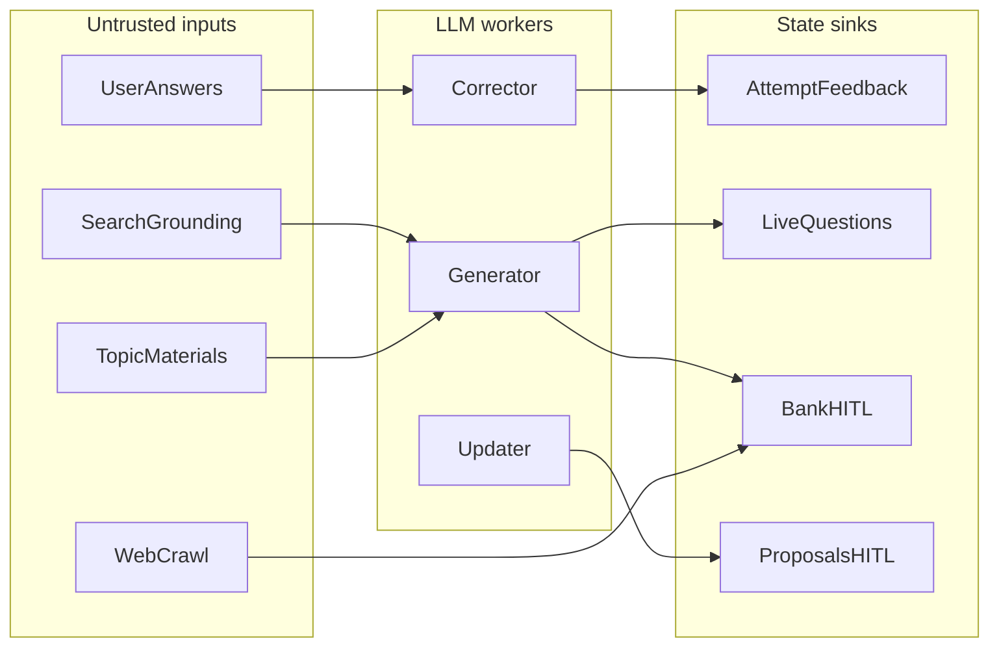

# OWASP GenAI LLM Top 10 (2026) — Security Audit

**Target:** Quizzeira  
**Framework:** OWASP Top 10 for LLM Applications 2026  
**Date:** 2026-09-08 (remediated same day)  
**Scope:** GenAI surfaces (workers, prompts, agency, output sinks, budgets).

Companion control map: [guardrails.md](./guardrails.md).

## Verdict (post-remediation)

Quizzeira remains a GenAI app with fencing, scoped `/internal` keys, Redis call+token budgets, output screening on persist, media URL allowlisting, HITL for updater + LLM/past-exam bank deposits, and a tightened grounding gate (no Search when any materials are present).

**Residual:** pill questions and inferred syllabus still apply live after screening (learner UX). Regex injection filters remain depth-in-defense, not prevention.

## Remediation status

| Priority | Item | Status |
| --- | --- | --- |
| 1 | Media allowlist + block `data:` + `screenModelStrings` on persist | Done |
| 2 | HITL for bank LLM/past-exam deposits; stronger validation for pills | Done |
| 3 | Scoped `/internal` keys + localhost compose bind | Done |
| 4 | Require Redis + daily token hard halt | Done |
| 5 | Grounding off when any materials present | Done |

## Findings (original → residual)

| ID | Original | Residual severity |
| --- | --- | --- |
| LLM01 | Medium | Medium (by design) |
| LLM02 | Medium/Low | Low |
| LLM03 | High | Medium (pills/syllabus still live) |
| LLM04 | Medium/Info | Info |
| LLM05 | Medium | Low (bank LLM HITL) |
| LLM06 | Medium | Low |
| LLM07 | Medium | Medium (pills) |
| LLM08 | Low/Medium | Low |
| LLM09 | N/A | N/A |
| LLM10 | High | Low |

## Surfaces

| Surface | Path |
| --- | --- |
| LLM loop | `packages/worker-kit/src/llm.ts`, `guardrails.ts` |
| Output / media | `packages/shared/src/output-policy.ts`, `media-url.ts` |
| Agency | `apps/api/src/plugins/internal-auth.ts`, `bank-proposal.store.ts`, `admin` proposals |
| Workers | corrector, generator, updater, exam-crawler |
